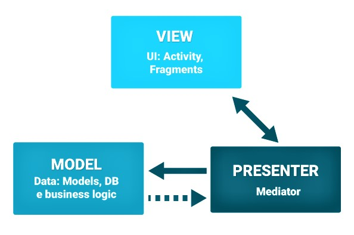

# 2.4 Architettura
## 2.4.1 Model View Presenter

È stato scelto di utilizzare come modello architetturale il **Model View Presenter** che è fortemente consigliato per chi sviluppa delle applicazioni per dispositivi Android.
Il MVP Fornisce un modo semplice per mostrare la struttura del prodotto garantendo modularità, testabilità e in generale una base di codice più pulita e gestibile.
Ne deriva quindi l'applicazione del paradigma *separation of concerns*, che separa la responsabilità tra le differenti parti del pattern.

<figcaption align="center"> <em> Schema del pattern architetturale MVP </em> </figcaption>

### 2.4.1.1 Model

Il **Model** è la parte che ha la responsabilità di gestione dei dati e rappresenta il layer di persistenza dell'applicazione. La maggior parte delle operazioni e dei controlli vengono svolti al suo interno. Contiene anche i metodi che avviano le connessioni alle API ed interagiscono con esse eseguendo numerose funzionalità. Vi sono, ad esempio, i metodi che
consentono la comunicazione con il backend; parte del modello è costituito dalla lista delle organizzazioni che si ottiene avviando una connessione al server, scaricando i dati in
formato JSON e salvandoli in seguito localmente.

### 2.4.1.2 View

La View ha la responsabilità di passare i dati al Presenter. Essa è implementata da:

  * Attività (activity);
  * Frammenti (fragment);
  * Qualsiasi forma grafica con cui l'utente finale dell'applicazione andrà ad interagire come ad esempio: ProgressBar, TextView, RecyclerView, ecc.   

In altre parole la View è la user interface.

### 2.4.1.3 Presenter

Il **Presenter** funge da livello intermedio tra la **View** e il **Model**. Tutta la logica di presentazione appartiene ad esso ed è responsabile dell'interrogazione del modello e l'aggiornamento della vista, reagendo alle interazioni che compie l'utente nella UI. Un valore aggiunto è che il **Presenter** dipende dall'astrazione della **View** e non dalla sua concretizzazione, quindi non conosce la sua implementazione. Tutto ciò favorisce ad una più facile attività di test tramite anche l'utilizzo di mock.

### 2.4.1.4 Contract

Il **Contract**, come suggerisce il nome, può essere visto come un contratto nel quale vengono definiti tutti i metodi che verranno utilizzati dalla **View**, dal **Presenter** e dal **Model**.
Quando si ha intenzione di scrivere una nuova funzionalità, è buona norma scrivere un **Contract** al primo passaggio. Esso descrive la comunicazione tra **View-Presenter** e
**Model-Presenter**, consentendo una progettazione più pulita e diminuire le dipendenze tra le componenti.  
Il **Contract** è un'interfaccia utilizzata per ogni fragment presente nell'applicazione e contiene le altre interfacce della **View**, **Presenter** e **Model** per garantire le varie comunicazioni.

