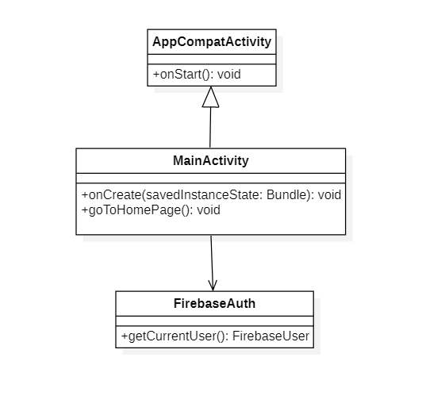
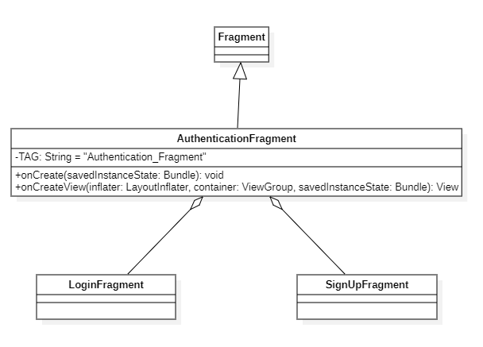
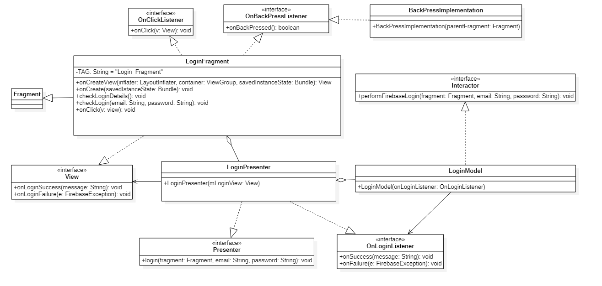
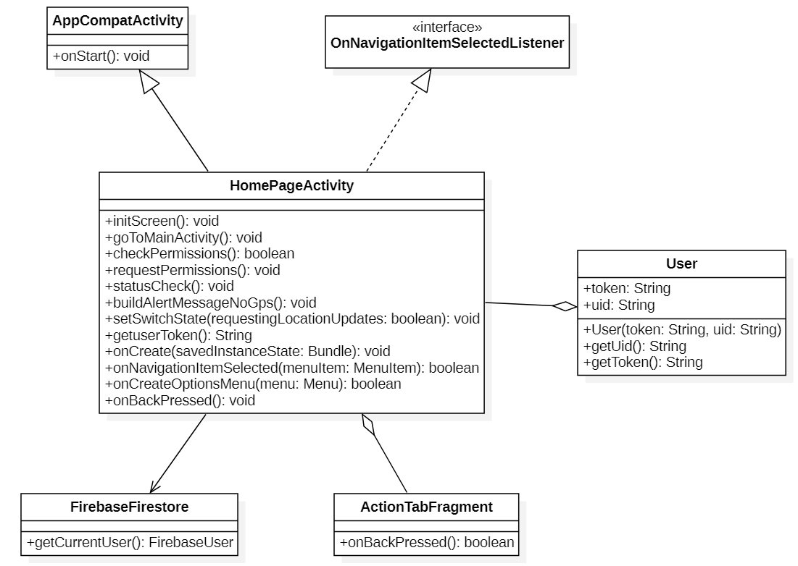
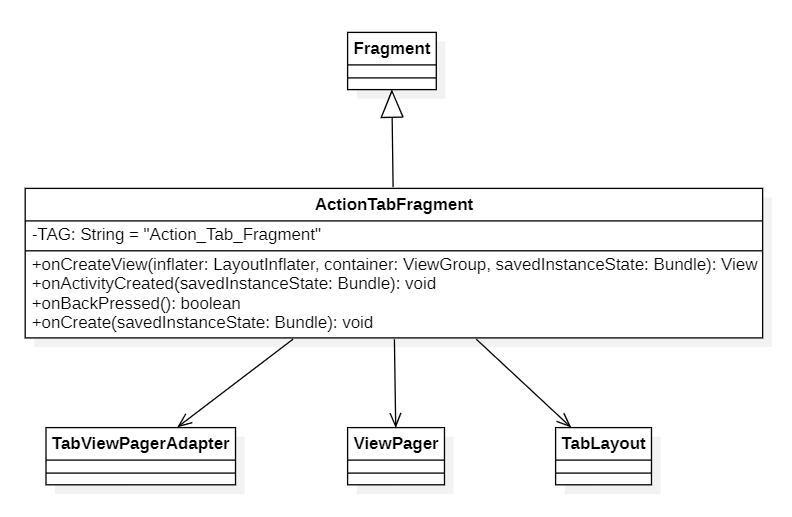
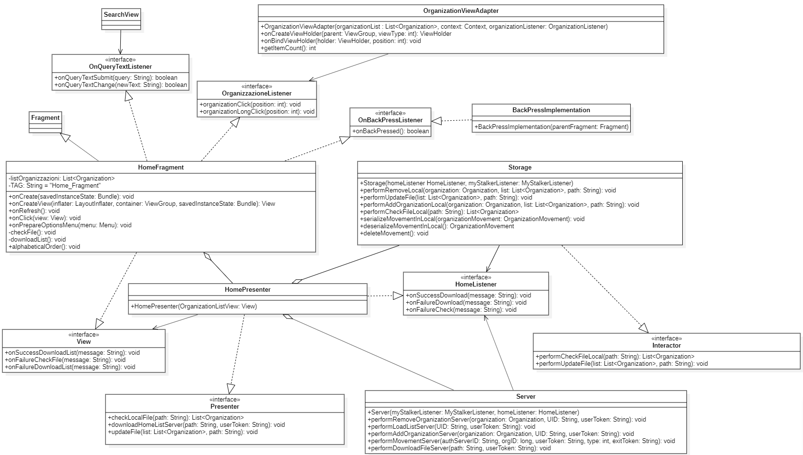
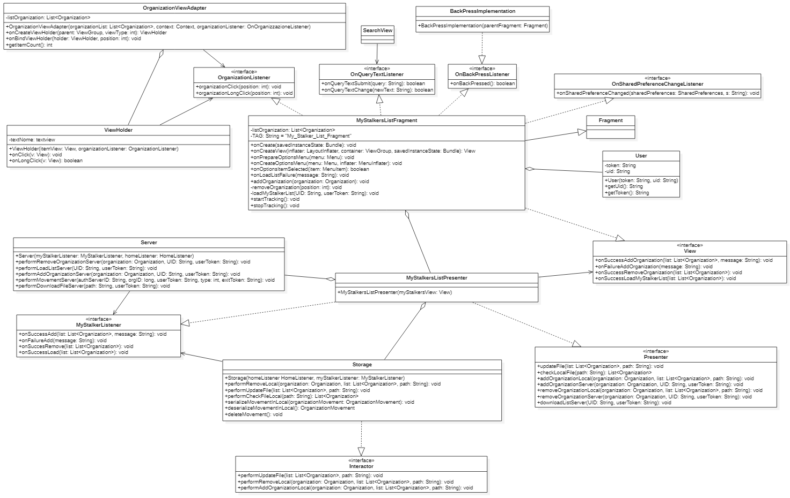
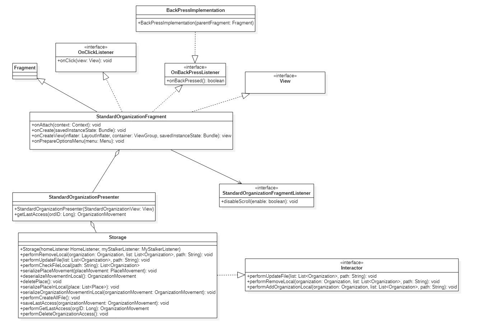
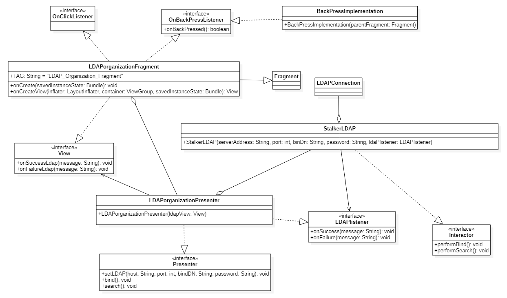

# 2.6 Diagrammi delle classi
Vengono presentati qui di seguito i diagrammi UML delle classi relativi all'applicazione.  

## 2.6.1 Main Activity

<figcaption align="center"> <em> Diagramma delle classi di Main Activity </em> </figcaption>

La classe `MainActivity` è l'Activity che viene utilizza quando l'utente non è autenticato. Essa contiene il fragment `AuthenticationFragment`.

La classe `MainActivity` offre i seguenti metodi:

-   `onStart()`:  Metodo che viene invocato all'apertura dell'applicazione, controlla se l'utente è autenticato e in caso positivo viene invocato il metodo `goToHomePage()`;

-   `onCreate(savedInstanceState: Bundle)`:  Si occupa della creazione dell'Activity e di mostrare a schermo l'`AuthenticationFragment`;

-   `goToHomePage()`:  Si occupa di spostare l'utente nell'`HomePageActivity`.

## 2.6.2 Authentication 

<figcaption align="center"> <em> Diagramma delle classi di Authentication </em> </figcaption>

La classe `AuthenticationFragment` fa parte della vista e mostra all'utente la pagina dove può scegliere se effettuare la registrazione oppure il login.

La classe `AuthenticationFragment` offre i seguenti metodi:

-   `onCreate(savedInstanceState: Bundle)`:  Si occupa della creazione del fragment in quanto componente;

-   `onCreateView(inflater: LayoutInflater, container: ViewGroup, savedInstanceState: Bundle)`: Si occupa della creazione della componente grafica visualizzata dall'utente e resta in attesa di un click da parte dell'utente in caso selezioni il pulsante "Login" o "Registrati" per aprire i rispettivi fragment.

___
## 2.6.3 Login

<figcaption align="center"> <em> Diagramma delle classi del Login </em> </figcaption>

La classe `LoginFragment`, così come `LoginPresenter` e `LoginModel` ad essa collegati, contengono tutti i metodi che permettono all'utente di autenticarsi.
L'utente per fare il Login deve inserire l'email e la password e successivamente cliccare sul pulsante "Login" per invocare i metodi di Firebase che verificano le credenziali e creano il collegamento.
In caso di successo l'utente sarà spostato nel `HomePageActivity.class` e visualizzerà un messaggio che indicherà il buon esito dell'autenticazione.
In caso di fallimento l'utente visualizza un messaggio di errore.

La classe LoginFragment offre i seguenti metodi:

-   `onCreate(savedInstanceState: Bundle)`:  Si occupa della creazione del fragment in quanto componente;

-   `onCreateView(inflater: LayoutInflater, container: ViewGroup, savedInstanceState: Bundle)`: Si occupa della creazione della parte grafica visualizzata dall'utente;

-   `onClick(View v)`: Attende un click dell'utente al pulsante "Login" per invocare il metodo `checkLoginDetails()`;

-   `checkLoginDetails()`: Controlla se l'utente ha scritto le proprie credenziali e le invia al metodo `initLogin(email: String, password: String)`, altrimenti segnala l'utente dell'assenza di esse;

-   `initLogin(email: String, password: String)`: Tramite l' MVP invoca i metodi di Firebase per verificare l'email e la password, in caso positivo invoca il metodo `onLoginSuccess(message: String)` mentre, in caso negativo invoca `onLoginFailure(e: FirebaseException)`;

-   `onLoginSuccess(message: String)`: L'autenticazione è andata a buon fine, l'utente sarà spostato nella `HomePageActivity.class` e visualizza un messaggio che indica che si è autenticato correttamente;

-   `onLoginFailure(e: FirebaseException)`: L'autenticazione è fallita e l'utente visualizza un messaggio che indica l'errore.

___
## 2.6.4 SignUp

<figcaption align="center"> <em> Diagramma delle classi del SignUp </em> </figcaption>

La classe `SignUpFragment`, così come `SignUpPresenter` e `SignUpModel` ad essa collegati, contengono tutti i metodi che permettono all'utente di registrarsi.
L'utente per registrarsi deve:
-   inserire l'email;
-   inserire la password;
-   confermare la password;
-   accettare le condizioni d'uso;
-   infine cliccare il pulsante "Registrati".
Una volta cliccato il pulsante vengono invocati i metodi della libreria Firebase che ti registrano nel sistema ed eseguono automaticamente il Login.

La classe SignUpFragment offre i seguenti metodi:

-   `onCreate(savedInstanceState: Bundle)`:  Si occupa della creazione del fragment in quanto componente;

-   `onCreateView(inflater: LayoutInflater, container: ViewGroup, savedInstanceState: Bundle)`: Si occupa della creazione della parte grafica visualizzata dall'utente;

-   `onClick(v: View)`: Attende un click dell'utente al pulsante "Sign Up" ("Registrati") per invocare il metodo `checkSignUpDetails()`, oppure un click a "Leggi le condizioni d'uso" per invocare il metodo `showTermsofUse()`;

-   `showTermsofUse()`: Apre un pop-up che mostra le condizioni d'uso che l'utente dovrà accettare;

-   `checkSignUpDetails()`: Controlla se l'utente ha scritto le proprie credenziali, confermato la password e accettato le condizioni d'uso, in caso positivo le invia al metodo `checkSignUp(email: String, password: String)`, altrimenti segnala l'utente dell'assenza di esse;

-   `checkSignUp(email: String, password: String)`: Tramite l' MVP invoca i metodi di Firebase per registrare l'email e la password, in caso di riuscita verrà invocato il metodo `onSignUpSuccess(message: String)`mentre, in caso di fallimento verrà invocato `onSignUpFailure(e: FirebaseException)`;

-   `onSignUpSuccess(message: String)`: La registrazione è andata a buon fine, l'utente sarà spostato nella `HomePageActivity.class` e visualizza un messaggio che indica che si è autenticato correttamente;

-   `onSignUpFailure(e: FirebaseException)`: La registrazione è fallita e l'utente visualizza un messaggio che indica l'errore;

-   `calculate(password: String)`: Calcola la complessità della password per verificarne la sicurezza.

## 2.6.5 Home Page Activity

<figcaption align="center"> <em> Diagramma delle classi di Home Page Activity </em> </figcaption>

La classe `HomePageActivity` è l'Activity principale da cui vengono istanziati i fragment riguardanti l'action tab `ActionTabFragment`, la lista delle organizzazioni `HomeFragment` e la lista dei preferiti/MyStalker `MyStalkersListFragment`.

La classe `HomePageActivity` offre i seguenti metodi:

-   `onCreate(savedInstanceState: Bundle)`:  Si occupa della creazione dell'Activity e gestisce i fragment a esso collegati. In questo metodo è presente il controllo dell'autenticazione dell'utente, in caso l'utente non è più collegato viene invocato il metodo `goToMainActivity()`;

-   `onCreateOptionsMenu(menu: Menu)`: Si occupa della creazione del menu action tab;

-   `initScreen()`:  Si occupa della gestione dell'`ActionTabFragment`;

-   `onBackPressed()`:  Si occupa della gestione del tasto indietro;

-   `onNavigationItemSelected(menuItem: MenuItem)`:  Si occupa della gestione del drawer;

-   `goToMainActivity()`:  Si occupa di spostare l'utente nella `MainActivity`;

-   `checkPermissions()`:  Controlla i permessi dell'utente riguardanti il tracciamento;

-   `requestPermissions()`: Richiede all'utente i permessi riguardanti il tracciamento;

-   `onRequestPermissionsResult(requestCode: int, permissions: String[], grantResults: int[])`:  Metodo che viene invocato una volta accettati i permessi riguardanti il tracciamento, nel caso in cui siano accettati, il tracciamento viene attivato, altrimenti lo switcher presente nel drawer `Tracciamento` viene impostato a OFF;

-   `statusCheck()`:  Controlla se il GPS è attivo;

-   `buildAlertMessageNoGps()`:  Si occupa di avvertire l'utente in caso il GPS non è attivo e di aiutarlo nella sua attivazione;

-   `setSwitchState(requestingLocationUpdates: boolean)`:  Si occupa della gestione dello switcher `Tracciamento` presente nel drawer;

-   `getuserToken()`:  Metodo che restituisce il token dell'utente.

___
## 2.6.6 Action Tab

<figcaption align="center"> <em> Diagramma delle classi del Action Tab </em> </figcaption>

La classe `ActionTabFragment` gestisce la view page principale dell'applicazione la quale contiene le due view principali ovvero: `HomeFragment` e `MyStalkerFragment`.
Si occupa inoltre di gestire il menu bar principale che permette all'utente di navigare tra le pagine dell'applicazione.

La classe ActionTabFragment offre i seguenti metodi:

-   `onCreate(savedInstanceState: Bundle)`:  Si occupa della creazione del fragment in quanto componente;

-   `onCreateView(inflater: LayoutInflater, container: ViewGroup, savedInstanceState: Bundle)`: Si occupa della creazione della parte grafica visualizzata dall'utente;

-   `public void onActivityCreated(savedInstanceState: Bundle)`: Segnala che la creazione dell’Activity è stata completata;

-   `onBackPressed()`: Si occupa di recuperare il fragment appartenente all'Action Tab attualmente visibile per poi propagare la sua callBack agli altri fragment.

___
## 2.6.7 Home 

<figcaption align="center"> <em> Diagramma delle classi di Home</em> </figcaption>

Se l'utente risulta essere già autenticato e avvia l'applicazione, oppure ha appena effettuato l'autenticazione, allora gli viene mostrato automaticamente la classe view del `HomeFragment`. In questa classe compariranno tutte le organizzazioni presenti nel server. L'utente ha la possibilità di aggiornare la lista oppure di scaricarla se dovessero incombere dei problemi.

La classe `HomeFragment` offre i seguenti metodi:

-   `onCreate(savedInstanceState: Bundle)`:  Si occupa della creazione del fragment in quanto componente;

-   `onCreateView(inflater: LayoutInflater, container: ViewGroup, savedInstanceState: Bundle)`: Si occupa della creazione della parte grafica visualizzata dall'utente;

-   `checkFile()`: Si occupa di andare a caricare la lista delle organizzazioni andandole a caricare direttamente da FileSystem;

-   `onFailureCheckFile(message: String)`: Si occupa di gestire un eventuale errore durante la lettura da FileSystem, fa visualizzare all'utente l`errore durante il caricamento;

-   `downloadList()`: Si occupa di scaricare la lista dal Server e in caso affermativo la salva su FileSystem;

-   `onSuccessDownloadList(message: String)`: Si occupa di notificare all'utente il corretto scaricamento della lista dal Server;

-   `onFailureDownloadList(message: String)`: Si occupa di notificare all'utente il fallimento dello scaricamento della lista dal Server;

-   `organizationClick(position: int)`: Si occupa di inizializzare e far visualizzare all'utente il fragment della organizzazione, questo metodo viene invocato a seguito a un click dell'utente;

-   `organizationLongClick(position: int)`: Notifica all'utente attraverso una finestra di dialogo, informazioni aggiuntive dell'organizzazione selezionata dall'utente in seguito ad un click prolungato;

-   `alphabeticalOrder()`: Si occupa di ordinare la lista presente nella view `Home Fragment` in ordine alfabetico;

-   `onPrepareOptionsMenu(menu: Menu)`: Nasconde al menù action tab dell'applicazione l'opzione 'aggiungi ai preferiti' e rende visibile il comando di ricerca; 

-   `onQueryTextChange(newText: String)`: Si occupa di visualizzare a schermo la lista delle organizzazioni in seguito agli input inseriti dall'utente nel menu di ricerca;

-   `onBackPressed()`: Si occupa di far ritornare l'utente alla precedente Activity/Fragment.

___
## 2.6.8 My Stalkers List 

<figcaption align="center"> <em> Diagramma delle classi di My Stalkers List </em> </figcaption>

In questa classe compariranno tutte le organizzazioni abilitate nel tracciamento dell'utente in precedenza aggiunte sia localmente che sul server. È possibile la rimozione dell'organizzazione dalla lista `MyStalkers` non consentendone più il tracciamento. Queste funzioni possono essere eseguite direttamente nell'applicazione. 

La classe `MyStalkerListFragment` offre i seguenti metodi:

-   `onServiceConnected(name: ComponentName, service: IBinder)`: Metodo della classe interna `ServiceConnection` che permette di stabile una connessione con il `Bind Service`;

-   `onServiceDisconnected(name: ComponentName)`: Metodo della classe interna `ServiceConnection` che permette di disconnettere la connessione con il `Bind Service`;

-   `onCreate(savedInstanceState: Bundle)`: Si occupa della creazione del fragment in quanto componente;

-   `onCreateView(inflater: LayoutInflater, container: ViewGroup, savedInstanceState: Bundle)`: Si occupa di creare il layout del fragment;

-   `organizationClick(position: int)`: Si occupa di inizializzare e far visualizzare all'utente il fragment della organizzazione in seguito ad un rapido click;

-   `organizationLongClick(position: int)`: Notifica all'utente attraverso una finestra di dialogo, la possibilità di eliminare l'organizzazione selezionata dall'utente in seguito ad un click prolungato;

-   `onPrepareOptionsMenu(menu: Menu)`: Nasconde al menù action tab dell'applicazione l'opzione 'aggiungi ai preferiti' e rende visibile il comando di ricerca; 

-   `onQueryTextChange(newText: String)`: Si occupa di visualizzare a schermo la lista delle organizzazioni in seguito agli input inseriti dall'utente nel menu di ricerca;

-   `addOrganization(organization: Organization)`: Si occupa di aggiungere l'organizzazione ricevuta in input sia sul FileSystem sia sul Server;

-   `onSuccessAddOrganization(list: ArrayList<Organization>, message: String)`: Notifica all'utente il successo dell'operazione di aggiunta dell'organizzazione;

-   `onFailureAddOrganization(message: String)`: Notifica all'utente l'insuccesso dell'operazione di aggiunta dell'organizzazione;

-   `removeOrganization(position: int)`: Si occupa di rimuovere un'organizzazione sia dal FileSystem sia dal Server;

-   `onSuccessRemoveOrganization(list: ArrayList<Organization>)`: Notifica all'utente il successo dell'operazione di rimozione di una organizzazione;

-   `loadMyStalkerList(UID: String, userToken: String)`: Si occupa di scaricare dal Server la lista delle organizzazioni aggiunte dall'utente in precedenza;

-   `checkForUpdate()`: Si occupa di tenere traccia delle eventuali modifiche apportate dall'utente della sua lista delle organizzazioni presenti nella view `MyStalkerListFragment`;

-   `onSuccessLoadMyStalkerList(list: List<Organization>)`: Notifica all'utente il successo dello scaricamento della sua lista delle organizzazioni inserite in `MyStalkersList` e le mostra a schermo;

-   `onPause()`: Metodo che viene invocato quando l'Activity principale viene è in pausa e ci si aspetta un suo ritorno in breve tempo;

-   `onStop()`: Metodo che viene invocato quando l'Activity principale non è più visibile all'utente, ovvero quando quest'ultimo ha deciso di chiudere l'applicazione;

-   `onSharedPreferenceChanged(sharedPreferences: SharedPreferences, s: String)`: Metodo che viene chiamato quando una risorsa condivisa (tra due view) viene modificata, aggiunta o rimossa;

-   `startTracking()`: Metodo per gestire l'inizio del tracciamento facendo riferimento alle organizzazioni scelte ed inserite dall'utente nella view `MyStalkersList`;

-   `stopTracking()`: Metodo per gestire la terminazione del tracciamento facendo riferimento alle organizzazioni scelte ed inserite dall'utente nella view `MyStalkersList`;

-   `onBackPressed()`: Si occupa di fa ritornare l'utente alla precedente Activity/Fragment.
___
## 2.6.9 Standard Organization

<figcaption align="center"> <em> Diagramma delle classi dello Standard Organization</em> </figcaption>

La classe `StandardOrganizationFragment` rappresenta la pagina dedicata alle organizzazioni pubbliche, cioè quelle che non richiedono credenziali di autenticazione LDAP. La vista contiene le informazioni riferite all'organizzazione.
Qualora l'organizzazione dovesse essere aggiunta nella lista `MyStalkers` allora comparirà al suo interno una sezione che mostra se l'utente è dentro o fuori l'organizzazione.

La classe StandardOrganizationFragment offre i seguenti metodi:

-   `onCreate(savedInstanceState: Bundle)`: Si occupa della creazione del fragment in quanto componente;

-   `onCreateView(inflater: LayoutInflater, container: ViewGroup, savedInstanceState: Bundle)`: Si occupa della creazione della parte grafica visualizzata dall'utente;

-   `onPrepareOptionsMenu(menu:Menu)`: Rende visibile al menù action tab dell'applicazione l'opzione 'aggiungi ai preferiti' e nasconde il comando di ricerca; 

-   `onOptionsItemSelected(item:MenuItem)`: Aggiunge l'organizzazione nella lista dei preferiti.

___
## 2.6.10 LDAP Organization

<figcaption align="center"> <em> Diagramma delle classi del LDAP Organization </em> </figcaption>

La classe `LDAPorganizationFragment` rappresenta la pagina dedicata alle organizzazioni che richiedono credenziali LDAP. La vista contiene le informazioni riferite all'organizzazione e un pulsante che fa aprire un pop-up dove è possibile inserire i dati di autenticazione.
Un utente, per poter essere tracciato dall'organizzazione privata, ha bisogno prima di autenticarsi ed in seguito a ciò se l'esito fosse positivo allora l'organizzazione viene automaticamente inserita nella lista delle organizzazioni `MyStalker` (lista preferite). In seguito apparirà uno switch dove è possibile cambiare la tipologia di tracciamento. 
Le credenziali che ha digitato l'utente vengono spedite al modello che interrogherà il server dedicato al LDAP dell'organizzazione. L'esito di questa procedura verrà rimandata
alla vista e apparirà una notifica visibile sulla schermata per avvisare l'utente.

La classe `LDAPorganizationFragment` offre i seguenti metodi:

-   `onCreate(saveInstanceState: Bundle)`: Si occupa della creazione del fragment in quanto componente;

-   `onCreateView(inflater: LayoutInflater, container: ViewGroup, savedInstanceState: Bundle)`: Si occupa della creazione della parte grafica visualizzata dall'utente.

