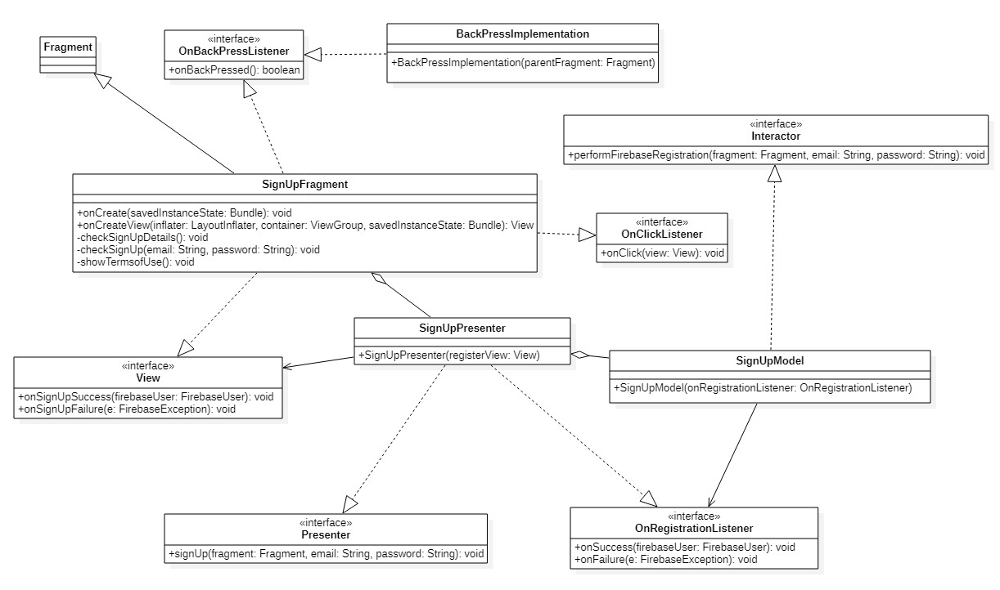
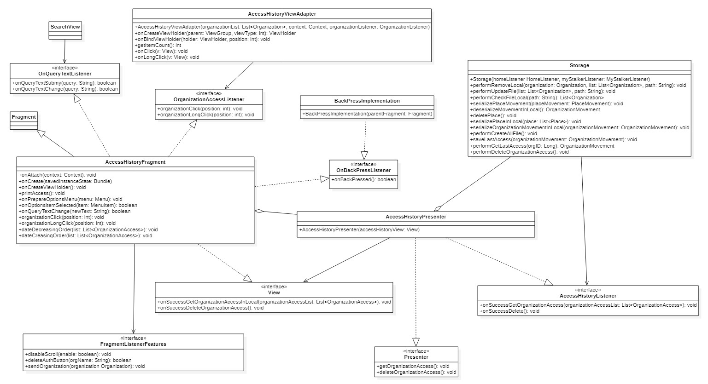

# 2.6 Diagrammi delle classi
Vengono presentati qui di seguito i diagrammi UML delle classi relativi all'applicazione.  

## 2.6.1 MainActivity

<figcaption align="center"> <em> Diagramma della classe Main Activity </em> </figcaption>

La classe `MainActivity` è l'Activity che viene utilizza quando l'utente non è autenticato. Essa contiene il fragment `AuthenticationFragment`.

La classe `MainActivity` offre i seguenti metodi:

-   `onStart()`:  Metodo che viene invocato all'apertura dell'applicazione, controlla se l'utente è autenticato e in caso positivo viene invocato il metodo `goToHomePage()`;

-   `onCreate(savedInstanceState: Bundle)`:  Si occupa della creazione dell'Activity e di mostrare a schermo l'`AuthenticationFragment`;

-   `goToHomePage()`:  Si occupa di spostare l'utente nell'`HomePageActivity`.

## 2.6.2 Login

<figcaption align="center"> <em> Diagramma della classe Login </em> </figcaption>

La classe `LoginFragment` rappresenta la pagina dedicata alle autenticazioni degli utenti che desiderano, in seguito, utilizzare l'applicazione Android Stalker.
L'utente per autenticarsi deve:
- Inserire l'email;
- Inserire la password;
- Cliccare il pulsante "Log in".

In caso di fallimento l'utente visualizza un messaggio di errore. Una volta eseguita l'autenticazione comparirà la pagina dedicata alla lista delle organizzazioni (HomeFragment) e l'utente rimarrà autenticato a meno che non desidera fare il logout.

Qualora l'utente si fosse dimenticato la password è possibile eseguire il reset cliccando sul testo: "Password dimenticata?" e apparirà un pop-up dove l'utente dovrà inserire l'email. In conclusione l'utente riceverà una mail con un link per cambiare la password. 

Nel caso in cui l'utente desidera registrarsi può farlo nella parte sottostante della pagina dove vi è scritto "Non hai un account?" e cliccando il testo "Clicca qui". Dopo tale azione verrà aperta la pagina dedicata alla registrazione (SignUpFragment).

La classe `LoginFragment` utilizza le librerie di Firebase per consentire all'utente di autenticarsi e/o registrarsi presso il server. La classe offre i seguenti metodi:

-   `onCreate(savedInstanceState: Bundle)`:  Si occupa della creazione del Fragment in quanto componente;

-   `onCreateView(inflater: LayoutInflater, container: ViewGroup, savedInstanceState: Bundle)`: Si occupa della creazione della parte grafica visualizzata dall'utente;

-   `onClick(v: View)`: Attende un click dell'utente sul pulsante "Log in" per invocare il metodo `checkLoginDetails()` oppure sul pulsante "Password dimenticata?" invocando `forgotPassword()`;

-   `forgotPassword()`: Avvia il metodo che si occupa di gestire il reset della password aprendo un pop-up dove inserire l'email dell'account;

-   `checkLoginDetails()`: Check sulla validità delle credenziali inserite dall'utente che verranno in seguito mandate al server;

-   `checkLogin()`: Metodo che consente la comunicazione con il presenter;

-   `onLoginSuccess()`: L'autenticazione ha avuto esito positivo e si lo comunica all'utente tramite Toast e si avvia l'attività HomePageActivity;

-   `onCredentialFailure(e: FirebaseException)`: L'autenticazione ha avuto esito negativo e lo si comunica all'utente tramite Toast;

-   `onSendEmailSuccess() `: Metodo che avvisa l'utente tramite Toast che arriverà una mail per poter resettare la password.

## 2.6.3 SignUp

<figcaption align="center"> <em> Diagramma della classe SignUp </em> </figcaption>

La classe `SignUpFragment`, così come `SignUpPresenter` e `SignUpModel` ad essa collegati, contengono tutti i metodi che permettono all'utente di registrarsi.
L'utente per registrarsi deve:
- Inserire l'email;
- Inserire la password;
- Confermare la password;
- Accettare le condizioni d'uso;
- Infine cliccare il pulsante "Registrati".
Una volta cliccato il pulsante vengono invocati i metodi della libreria Firebase che ti registrano nel sistema ed eseguono automaticamente il Login.

La classe `SignUpFragment` offre i seguenti metodi:

-   `onCreate(savedInstanceState: Bundle)`:  Si occupa della creazione del fragment in quanto componente;

-   `onCreateView(inflater: LayoutInflater, container: ViewGroup, savedInstanceState: Bundle)`: Si occupa della creazione della parte grafica visualizzata dall'utente;

-   `onClick(v: View)`: Attende un click dell'utente al pulsante "Sign Up" ("Registrati") per invocare il metodo `checkSignUpDetails()`, oppure un click a "Leggi le condizioni d'uso" per invocare il metodo `showTermsofUse()`;

-   `checkSignUpDetails()`: Controlla se l'utente ha scritto le proprie credenziali, confermato la password e accettato le condizioni d'uso, in caso positivo le invia al metodo `checkSignUp(email: String, password: String)`, altrimenti segnala l'utente dell'assenza di esse;

-   `checkSignUp(email: String, password: String)`: Tramite l' MVP invoca i metodi di Firebase per registrare l'email e la password, in caso di riuscita verrà invocato il metodo `onSignUpSuccess(message: String)`mentre, in caso di fallimento verrà invocato `onSignUpFailure(e: FirebaseException)`;

-   `showTermsofUse()`: Apre un pop-up che mostra le condizioni d'uso che l'utente dovrà accettare;

-   `onSignUpSuccess(message: String)`: La registrazione è andata a buon fine, l'utente sarà spostato nella `HomePageActivity.class` e visualizza un messaggio che indica che si è autenticato correttamente;

-   `onSignUpFailure(e: FirebaseException)`: La registrazione è fallita e l'utente visualizza un messaggio che indica l'errore;

-   `onBackPressed()`: Si occupa di far ritornare l'utente alla precedente Activity/Fragment.

## 2.6.4 Home Page Activity

<figcaption align="center"> <em> Diagramma della classe Home Page Activity</em> </figcaption>

La classe `HomePageActivity` è l'Activity principale da cui vengono istanziati i fragment riguardanti l'action tab `ActionTabFragment`, la lista delle organizzazioni `HomeFragment` e la lista dei preferiti/MyStalker `MyStalkersListFragment`.

La classe `HomePageActivity` offre i seguenti metodi:

-   `onCreate(savedInstanceState: Bundle)`:  Si occupa della creazione dell'Activity e gestisce i fragment a esso collegati.
 
-   `onResume()`: Metodo che viene invocato quando l'applicazione è in pausa, in attesa di un input da parte dell'utente;

-   `onPause()`: Metodo che viene invocato quando l'Activity principale viene messa in pausa e ci si aspetta un suo ritorno in breve tempo;

-   `updateFirebaseToken`: Si occupa di aggiornare il Token di firebase;

-   `onCreateOptionsMenu(menu: Menu)`: Si occupa della creazione del menu action tab;

-   `initScreen()`:  Si occupa della gestione dell'`ActionTabFragment`;

-   `onBackPressed()`:  Si occupa della gestione del tasto indietro;

-   `onNavigationItemSelected(menuItem: MenuItem)`:  Si occupa della gestione del drawer;

-   `goToMainActivity()`:  Si occupa di spostare l'utente nella `MainActivity`;

-   `checkPermissions()`:  Controlla i permessi dell'utente riguardanti il tracciamento;

-   `requestPermissions()`: Richiede all'utente i permessi riguardanti il tracciamento;

-   `onRequestPermissionsResult(requestCode: int, permissions: String[], grantResults: int[])`:  Metodo che viene invocato una volta accettati i permessi riguardanti il tracciamento, nel caso in cui siano accettati, il tracciamento viene attivato, altrimenti lo switcher presente nel drawer `Tracciamento` viene impostato a OFF;

-   `startTracking()`: Metodo per gestire l'inizio del tracciamento facendo riferimento alle organizzazioni scelte ed inserite dall'utente nella view `MyStalkersList`;

-   `stopTracking()`: Metodo per gestire la terminazione del tracciamento facendo riferimento alle organizzazioni scelte ed inserite dall'utente nella view `MyStalkersList`;
 
-   `statusCheck()`:  Controlla se il GPS è attivo;

-   `buildAlertMessageNoGps()`:  Si occupa di avvertire l'utente in caso il GPS non è attivo e di aiutarlo nella sua attivazione;

-   `setSwitchState(requestingLocationUpdates: boolean)`:  Si occupa della gestione dello switcher `Tracciamento` presente nel drawer;
 
- `getPath()`: Metodo che restituisce il percorso in cui sono memorizzati i file;
 
- `getTabLayout()`: Metodo che restituisce il TabLayout;

## 2.6.5 ActionTab

<figcaption align="center"> <em> Diagramma della classe Action Tab </em> </figcaption>

La classe `ActionTabFragment` gestisce la view page principale dell'applicazione la quale contiene le due view principali ovvero: `HomeFragment` e `MyStalkerFragment`.
Si occupa inoltre di gestire il menu bar principale che permette all'utente di navigare tra le pagine dell'applicazione.

La classe `ActionTabFragment` offre i seguenti metodi:

-   `onCreate(savedInstanceState: Bundle)`:  Si occupa della creazione del fragment in quanto componente;

-   `onCreateView(inflater: LayoutInflater, container: ViewGroup, savedInstanceState: Bundle)`: Si occupa della creazione della parte grafica visualizzata dall'utente;

-   `onActivityCreated(savedInstanceState: Bundle)`: Segnala che la creazione dell’Activity è stata completata;

-   `onBackPressed()`: Si occupa di recuperare il fragment appartenente all'Action Tab attualmente visibile per poi propagare la sua callBack agli altri fragment;

- `getMyStalkerFragment()` : Metodo che restituisce il Fragment in cui si trova l'utente;

- `getHomeFragment()` : Metodo che restituisce l' HomeFragment;

- `getAccessHistoryFragment()` : Metodo che restituisce l' AccessHistoryFragment;

- `getTabLayout()` : Metodo che restituisce il TabLayout;

- `disableScroll(enable: boolean)` : Metodo che impedisce all'utente di passare da un tab all'altro.

## 2.6.6 Home 

<figcaption align="center"> <em> Diagramma della classe Home</em> </figcaption>

Se l'utente risulta essere già autenticato e avvia l'applicazione, oppure ha appena effettuato l'autenticazione, allora gli viene mostrato automaticamente la classe view del `HomeFragment`. In questa classe compariranno tutte le organizzazioni presenti nel server. L'utente ha la possibilità di aggiornare la lista oppure di scaricarla se dovessero incombere dei problemi.

La classe `HomeFragment` offre i seguenti metodi:

-   `onAttach(context: Context)`: Assicura che l'attività abbia effettivamente implementato il nostro listener e che esso non sia nulla;

-   `onCreate(savedInstanceState: Bundle)`:  Si occupa della creazione del fragment in quanto componente;

-   `onCreateView(inflater: LayoutInflater, container: ViewGroup, savedInstanceState: Bundle)`: Si occupa della creazione della parte grafica visualizzata dall'utente;

-   `checkFile()`: Si occupa di andare a caricare la lista delle organizzazioni andandole a caricare direttamente da FileSystem;

-   `onFailureCheckFile(message: String)`: Si occupa di gestire un eventuale errore durante la lettura da FileSystem, fa visualizzare all'utente l`errore durante il caricamento;

-   `downloadList()`: Si occupa di scaricare la lista dal Server e in caso affermativo la salva su FileSystem;

-   `onSuccessDownloadList(message: String)`: Si occupa di notificare all'utente il corretto scaricamento della lista dal Server;

-   `onFailureDownloadList(message: String)`: Si occupa di notificare all'utente il fallimento dello scaricamento della lista dal Server;

-   `organizationClick(position: int)`: Si occupa di inizializzare e far visualizzare all'utente il fragment della organizzazione, questo metodo viene invocato a seguito a un click dell'utente;

-   `organizationLongClick(position: int)`: Notifica all'utente attraverso una finestra di dialogo, informazioni aggiuntive dell'organizzazione selezionata dall'utente in seguito ad un click prolungato;

-   `alphabeticalOrder()`: Si occupa di ordinare la lista presente nella view `Home Fragment` in ordine alfabetico;

-   `onPrepareOptionsMenu(menu: Menu)`: Nasconde al menù action tab dell'applicazione l'opzione 'aggiungi ai preferiti' e rende visibile il comando di ricerca; 

-   `resetAdapter()`: Sostituisce l'attuale lista delle organizzazioni con una lista predefinita precedentemente utilizzata;

-   `onOptionsItemSelected (item MenuItem)`: Si occupa di cambiare la tipologia di filtraggio per la ricerca scegliendo, in maniera mutualmente esclusiva, tra ricerca per nome, città, nazione, organizzazione a tracciamento anonimo o autenticato;

-   `onQueryTextSubmit(query string)`: metodo che viene chiamato quando l'utente invia una query;

-   `onQueryTextChange(newText: String)`: Si occupa di visualizzare a schermo la lista delle organizzazioni in seguito agli input inseriti dall'utente nel menu di ricerca;

-   `countryDialog(item MenuItem)`: Si occupa di gestire il filtraggio di ricerca per i country;

-   `printCountrySelected()`: Si occupa di visualizzare nella lista principale e nella lista dei preferiti solo le organizzazioni che hanno il campo dati 'country' uguale a quello selezionato dall'utente;

-   `onBackPressed()`: Si occupa di far ritornare l'utente alla precedente Activity/Fragment.

## 2.6.7 MyStalkersList

<figcaption align="center"> <em> Diagramma della classe My Stalkers List </em> </figcaption>

In questa classe compariranno tutte le organizzazioni abilitate nel tracciamento dell'utente in precedenza aggiunte sia localmente che sul server. È possibile la rimozione di un'organizzazione dalla lista `MyStalkers` non consentendone più il tracciamento. Queste funzioni possono essere eseguite direttamente nell'applicazione. 
`MyStalkersListFragment` utilizza le classi del modello `Storage` e `Server` per scaricare la lista delle organizzazioni preferite e avvertire il server quando ne viene aggiunta o rimossa una.

La classe `MyStalkerListFragment` offre i seguenti metodi:

- `onAttach(context: Context)`: Assicura che l'attività abbia effettivamente implementato il nostro listener e che esso non sia nulla;

-  `onCreate(savedInstanceState: Bundle)`: Si occupa della creazione del fragment in quanto componente;

-   `onCreateView(inflater: LayoutInflater, container: ViewGroup, savedInstanceState: Bundle)`: Si occupa di creare il layout del fragment;

-   `onPrepareOptionsMenu(menu: Menu)`: Nasconde al menù action tab dell'applicazione l'opzione 'aggiungi ai preferiti' e rende visibile il comando di ricerca; 
 
- `resetAdapter()` : Si occupa di resettare il filtro di ricerca facendolo ritornare alla ricerca per nome;

- `onOptionsItemSelected (item: MenuItem)` : Indica l'azione da svolgere ad ogni elemento del menù della barra di ricerca quando viene selezionato;
 
-  `countryDialog(item: MenuItem)` : Si occupa di visualizzare a schermo una lista di tutte le nazioni, l'utente selezionandone una effettuerà una ricerca per nome solo per la nazione scelta;

- `printCountrySelected()` : Metodo invocato da countryDialog che modifica la lista delle organizzazioni per mostrare solo quelle appartenenti alla nazione scelta;
        
-   `addOrganization(organization: Organization)`: Si occupa di aggiungere l'organizzazione ricevuta in input sia sul FileSystem sia sul Server;

-   `onSuccessAddOrganization(list: ArrayList<Organization>, message: String)`: Notifica all'utente il successo dell'operazione di aggiunta dell'organizzazione;

-   `onFailureAddOrganization(message: String)`: Notifica all'utente l'insuccesso dell'operazione di aggiunta dell'organizzazione;

-   `removeOrganization(position: int)`: Si occupa di rimuovere un'organizzazione sia dal FileSystem sia dal Server;

-   `onSuccessRemoveOrganization(list: ArrayList<Organization>)`: Notifica all'utente il successo dell'operazione di rimozione di una organizzazione;

-   `loadMyStalkerList(UID: String, userToken: String)`: Si occupa di scaricare dal Server la lista delle organizzazioni aggiunte dall'utente in precedenza;

-   `onSuccessLoadMyStalkerList(list: List<Organization>)`: Notifica all'utente il successo dello scaricamento della sua lista delle organizzazioni inserite in `MyStalkersList` e le mostra a schermo;

- `organizationIsPresentInList(orgName: String)` : Controlla se esiste un'organizzazione data una stringa;

- `onBackPressed()`: Si occupa di fa ritornare l'utente alla precedente Activity/Fragment.

## 2.6.8 Standard Organization

<figcaption align="center"> <em> Diagramma della classe Standard Organization</em> </figcaption>

La classe `StandardOrganizationFragment` rappresenta la pagina dedicata alle organizzazioni pubbliche, cioè quelle che non richiedono credenziali di autenticazione LDAP. La vista contiene le informazioni riferite all'organizzazione.
Qualora l'organizzazione dovesse essere aggiunta nella lista `MyStalkers` allora comparirà al suo interno una sezione che mostra se l'utente è dentro o fuori l'organizzazione.

La classe `StandardOrganizationFragment` offre i seguenti metodi:

-   `onAttach(context: Context)`: Assicura che l'attività abbia effettivamente implementato il nostro listener e che esso non sia nulla;

-   `onCreate(savedInstanceState: Bundle)`: Si occupa della creazione del fragment in quanto componente;

-   `onCreateView(inflater: LayoutInflater, container: ViewGroup, savedInstanceState: Bundle)`: Si occupa della creazione della parte grafica visualizzata dall'utente;

-   `onPrepareOptionsMenu(menu:Menu)`: Rende visibile al menù action tab dell'applicazione l'opzione 'aggiungi ai preferiti' e nasconde il comando di ricerca; 

-   `onBackPressed()`: Si occupa di fa ritornare l'utente alla precedente Activity/Fragment.

-   `onClick(View v)`: Attende un click dell'utente al pulsante indicato da un orologio per poter visualizzare l'ultimo accesso effettuato dall'utente nell'organizzazione standard selezionata.

## 2.6.9 LDAPOrganization

<figcaption align="center"> <em> Diagramma della classe LDAP Organization </em> </figcaption>

La classe `LDAPorganizationFragment` rappresenta la pagina dedicata alle organizzazioni che richiedono credenziali LDAP. La vista contiene le informazioni riferite all'organizzazione e un pulsante che fa aprire un pop-up dove è possibile inserire i dati di autenticazione.
Un utente, per poter essere tracciato dall'organizzazione privata, ha bisogno prima di autenticarsi ed in seguito a ciò se l'esito fosse positivo allora l'organizzazione viene automaticamente inserita nella lista delle organizzazioni `MyStalker` (lista preferite).
Le credenziali che ha digitato l'utente vengono spedite al modello che interrogherà il server dedicato al LDAP dell'organizzazione. L'esito di questa procedura verrà rimandata alla vista e apparirà una notifica visibile sulla schermata per avvisare l'utente.

La classe `LDAPorganizationFragment` ha bisogno di utilizzare le librerie LDAP per poter effettuare la connessione al server e autenticare l'utente.
Essa offre i seguenti metodi:

-   `onAttach(context: Context)`: Assicura che l'attività abbia effettivamente implementato il nostro listener e che esso non sia nulla;

-   `onCreate(saveInstanceState: Bundle)`: Si occupa della creazione del Fragment in quanto componente;

-   `onCreateView(inflater: LayoutInflater, container: ViewGroup, savedInstanceState: Bundle)`: Si occupa della creazione della parte grafica visualizzata dall'utente;

-   `onPrepareOptionsMenu(menu: Menu)`: Nasconde gli elementi dei menu;

-   `onBackPressed()`:  Si occupa di far ritornare l'utente alla precedente Activity/Fragment;

-   `onClick(view: View)`:  Attende un click  da parte dell'utente sul pulsante "AUTENTICAZIONE" e verrà poi mostrato il pop-up di autenticazione;

-   `LDAPAuthentication()`: Si occupa di avviare la connessione al server LDAP una volta che l'utente ha inserito le credenziali nel pop-up di autenticazione;

-   `onSuccessLdap()`: L'autenticazione è avvenuta con successo, viene creata l'organizzazione che comparirà nella lista MyStalker e mostra all'utente l'esito tramite Toast;

-   `onFailureLdap()`: L'autenticazione è fallita e viene comunicato l'esito all'utente tramite Toast.

## 2.6.10 AccessHistory

<figcaption align="center"> <em> Diagramma della classe Access History </em> </figcaption>

La classe `AccessHistoryFragment` rappresenta la pagina dedicata allo storico degli accessi presso a tutte le organizzazioni scelte dall'utente per essere tracciato. Nel momento in cui un utente entra nell'organizzazione e conseguentemente esce da essa verrà stampato un elemento cliccabile ed informativo che mostra le informazione legate ai quei movimenti. Se l'utente è anche entrato nei luoghi dell'organizzazione tale informazione verrà registrata e mostrata nel "PlaceAccessFragment".

La classe `AccessHistoryFragment` offre i seguenti metodi:

-   `onAttach(context: Context)`: Assicura che l'attività abbia effettivamente implementato il nostro listener e che esso non sia nulla;

-   `onCreate(savedInstanceState: Bundle)`: Si occupa della creazione del Fragment in quanto componente;

-  `onCreateView(inflater: LayoutInflater, container: ViewGroup, savedInstanceState: Bundle)`: Si occupa della creazione della parte grafica visualizzata dall'utente;

-  `printAccess()`: Metodo che comunica con il presenter;

-  `onSuccessGetOrganizationAccessInLocal(organizationAccessList: List<OrganizationAccess>)`: Se c'è stato un corretto accesso ed uscita nell'organizzazione allora vengono salvate tali informazioni nella lista;

-  `onSuccessDeleteOrganizationAccess()`: Eliminazione lista degli accessi;

-  `onPrepareOptionsMenu(menu: Menu)`: Rende visibile al menù action tab dell'applicazione l'opzione 'aggiungi ai preferiti' e nasconde il comando di ricerca;

-  `onOptionsItemSelected(item: MenuItem)`: Funzionalità filtro di ricerca;

-  `onQueryTextChange(newText: String)`: Funzionalità di ricerca in base alle ricerche testuali digitate dall'utente;

-  `organizationClick(position: int)`:  L'utente dopo il click verrà proiettato in una pagina dedicata allo storico degli accessi presso ai luoghi dell'organizzazione;

-  `organizationLongClick(position: int)`: L'utente dopo il click viene aperto pop-up che mostra informazioni aggiuntive come il tempo di permanenza presso l'organizzazione e la modalità di tracciamento utilizzata in quel determinato accesso.

-  `onBackPressed()`: Si occupa di far ritornare l'utente alla precedente Activity/Fragment;

-  `dateDecreasingOrder(list: List<OrganizationAccess>)`: Ordina per data decrescente gli elementi della lista degli accessi;

-  `dateCreasingOrder(list: List<OrganizationAccess>)`: Ordina per data crescente gli elementi della lista degli accessi.

## 2.6.11 PlaceAccess

<figcaption align="center"> <em> Diagramma della classe Place Access</em> </figcaption>

La classe `PlaceAccessFragment` rappresenta la pagina dedicata alla memorizzazione degli accessi ai luoghi effettuati dall'utente di una determinata organizzazione.
In questa pagina ci saranno le informazioni sul nome del luogo, data, ora di accesso e ora di uscita in cui viene effettuato l'accesso.

La classe PlaceAccessFragment offre i seguenti metodi:

-   `onAttach(context: Context)`: Assicura che l'attività abbia effettivamente implementato il nostro listener e che esso non sia nulla;

-   `onCreate(savedInstanceState: Bundle)`: Si occupa della creazione del fragment in quanto componente;

-   `onCreateView(inflater: LayoutInflater, container: ViewGroup, savedInstanceState: Bundle)`: Si occupa della creazione della parte grafica visualizzata dall'utente;

-   `onPrepareOptionsMenu(menu:Menu)`: Rende visibile al menù action tab dell'applicazione l'opzione 'aggiungi ai preferiti' e nasconde il comando di ricerca; 

-   `onOptionsItemSelected(item:MenuItem)`: Aggiunge l'organizzazione nella lista dei preferiti;

-   `onSuccessGetPlaceAccessInLocal(placeAccessList: List<PlaceAccess>)`: Aggiunge una riga alla pagina dello storico degli accessi di un luogo contenente le informazioni sul nome di quel luogo e la sua data, ora di accesso e ora di uscita in cui viene effettuato l'accesso;

-   `onSuccessDeletePlaceAccess()`: Rimuove alla pagina tutti le righe degli accessi sui luoghi.