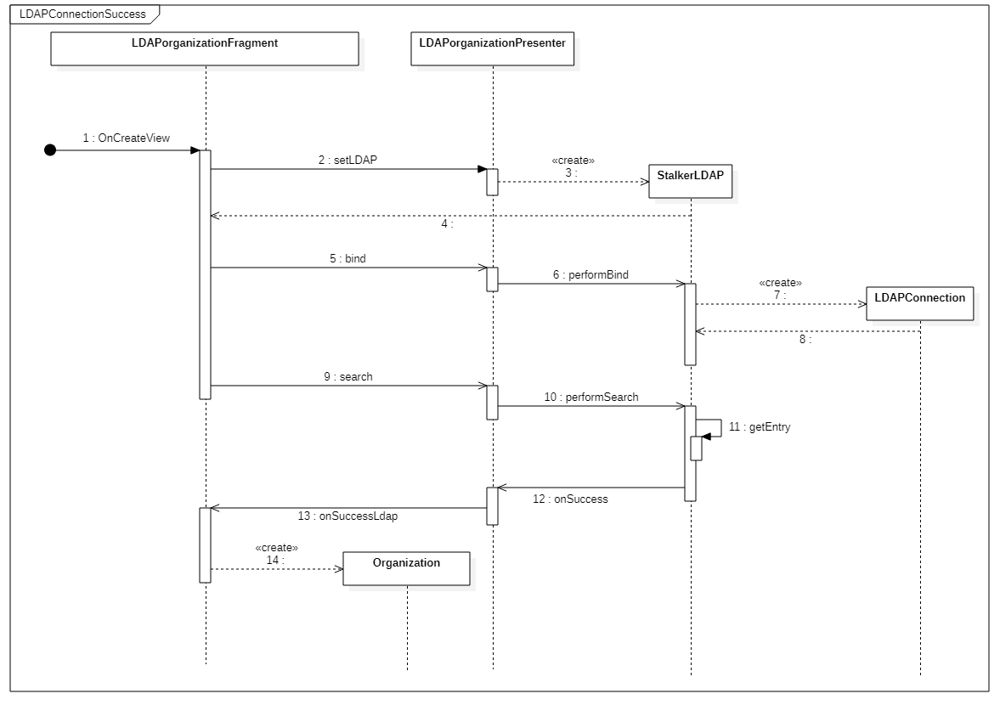

# 2.7 Diagramma delle sequenze
## 2.7.1 Diagramma dell'autenticazione al server LDAP

Questo diagramma di sequenza rappresenta la serie di azioni svolte dall'applicazione quando viene effettuata l'autenticazione LDAP.

La sequenza inizia con la selezione di una organizzazione autenticata e quindi la creazione del fragment **LDAPOrganizationFragment** tramite il metodo `onCreateView`.
Il fragment mostra a schermo una serie di informazioni riguardanti l'organizzazione scelta, l'utente tramite il pulsante "Autenticati" ha la possibilità di autenticarsi inserendo le proprie credenziali e selezionando il pulsante "Accedi".
Cliccando il pulsante Accedi le credenziali saranno passate al presenter **LDAPOrganizationPresenter** tramite il metodo `setLDAP`, le credenziali saranno successivamente usate per creare il modello **StalkerLDAP**.
**LDAPOrganizationFragment** successivamente procederà alla creazione del bind invocando il metodo del presenter `bind` e di conseguenza il metodo del modello `performBind`.
Il metodo `performBind` crea un oggetto di tipo **LDAPConnection** passandogli le credenziali, quindi crea un collegamento con il server LDAP.
Una volta che il collegamento al server è stato effettuato il fragment invocherà il metodo del presenter `search` e quindi il metodo del modello `performSearch`, il quale andrà a verificare se la connessione è stata effettuata con successo.
In caso di esito positivo il modello invoca il metodo del presenter `onSuccess`, quindi il metodo del fragment `onSuccessLdap` che procederà alla creazione di un oggetto **Organization** nella lista `MyStalker`.
