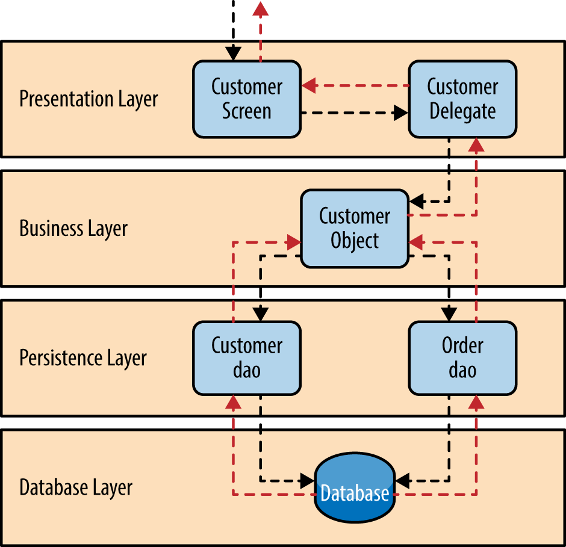
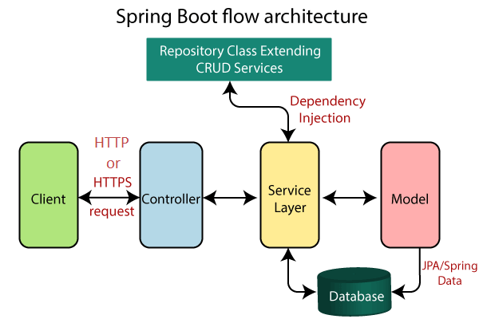

# 4.4 Architettura 
Per sviluppare il backend abbiamo utilizzato la **layered architecture**, in cui le varie funzionalità del software sono logicamente separate, ovvero suddivise su più strati o livelli software differenti in comunicazione tra loro.  
Ogni strato è caratterizzato  dallo svolgimento di un singolo e specifico ruolo, separato dagli altri strati, ma che ha dipendenze solo verso gli strati più bassi e offre servizi solo agli strati superiori rispetto a lui.

<figcaption align=center> <em> Esempio di Layered Architecture </em> </figcaption>

I layer di questo tipo di architettura sono implementati come segue nel backend:

- Il Presentation Layer è composto dalle classi Controller (annotate con `@Controller`) che sono invocati dal Front Controller per rispondere alle richieste HTTP ricevute dai client. I Controller si servono delle classi Service per soddisfare le richieste;

!!! info
    Per gestire tutte le richieste provenienti dal presentation layer Spring utilizza il pattern Front Controller, che implementa una componente chiamata `DispatcherServlet`. Essa si occupa di gestire tutte le richieste provenienti dalla rete e inviate (*to dispatch*) alle classi Controller in grado di soddisfarle, ovvero quelle che sono mappate a un certo URI ricercato tramite un mapping effettuato da un’altra componente definita *Handler Mapping*.
    Questo Handler sfrutta la annotation `@RequestMapping` per creare un’associazione tra URL e metodo Java da invocare che è stato scritto in una classe annotata `@Controller`.

- Il Business Layer è composto dalle classi Service(Impl) (annotate con `@Service`) che vengono utilizzati dai controller e si occupano di eseguire la business logic sui dati che sono rappresentati dalle classi del modello, i cui dati sono memorizzati su supporti persistenti;

- Il Persistence Layer, a cui il service layer fa riferimento per effettuare operazioni *CRUD* (Create Read Update Delete) sui dati, memorizza, nel caso di questo backend, i suoi dati su database SQL (MySQL), in-memory database/NoSQL (Redis) e servizi esterni (come Firebase).

Questa architettura ci garantisce facilità di testing e mantenimento dato il disaccoppiamento tra i diversi layer.  

Non richiedendo particolari configurazioni nel backend e per i vari layer, si è deciso di utilizzare il modulo Spring Boot del framework Spring, che evita allo sviluppatore di occuparsi di tutta la configurazione del web server. Quindi, nel backend non si trova implementato il `DispatcherServlet`.

L'immagine seguente mostra il flusso delle operazioni in Spring Boot:

In questa immagine:

- Controller corrisponde alle classi del Presentation Layer;
- Service Layer corrisponde al Business Layer;
- Model e Repository Class Extending CRUD Services corrispondono al Persistence Layer;
- Database corrisponde al Database Layer.