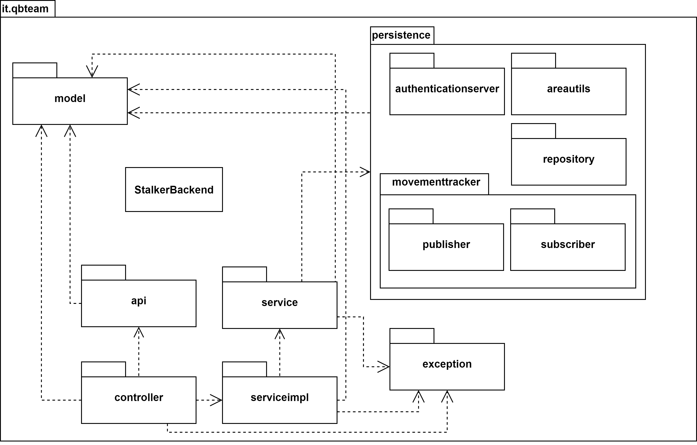
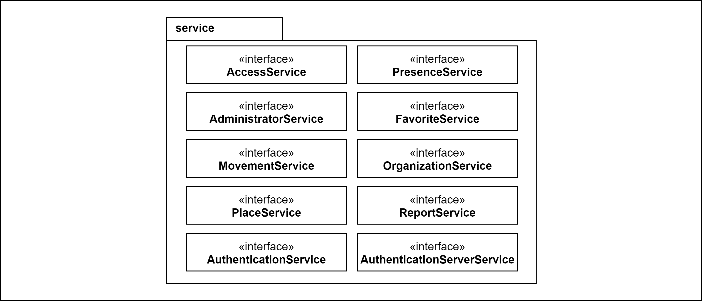
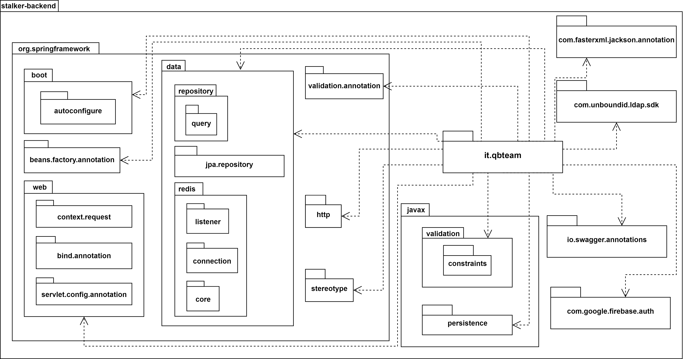

# 4.5 Diagrammi dei package
Vengono presentati qui di seguito i diagrammi UML dei package relativi al backend.

## 4.5.1 Generale
Nel seguente diagramma dei package vengono mostrate tutte le dipendenze che esistono tra i vari package che compongono il backend. 

<figcaption align=center> <em> Diagramma dei package - Package generale </em> </figcaption> 
 
## 4.5.2 Model
Nel seguente diagramma vengono rappresentate le classi che compongono il package del modello.  

<figcaption align=center> <em> Diagramma dei package - Package del modello </em> </figcaption>

## 4.5.3 API
Nel seguente diagramma vengono rappresentate le interfacce che compongono il package delle api, che corrispondo alle interfacce per i Controller.

<figcaption align=center> <em> Diagramma dei package - Package delle API</em> </figcaption>

## 4.5.4 Controller
Nel seguente diagramma vengono rappresentate le classi che compongono il package dei controller, che corrispondono alle classi che possiedono i metodi che rispondo alle richieste REST dei client (app utenti e web-app amministratori).

<figcaption align=center> <em> Diagramma dei package - Package del controller</em> </figcaption>

## 4.5.5 Service
Nel seguente diagramma vengono rappresentate le interfacce che compongono il package dei service, che rappresentano le interfacce per le classi del package serviceimpl.

<figcaption align=center> <em> Diagramma dei package - Package dei service </em> </figcaption>

## 4.5.6 Serviceimpl
Nel seguente diagramma vengono rappresentate le classi che implementano le interfacce del package Service e vanno a comporre il package ServiceImpl.  

<figcaption align=center> <em> Diagramma dei package - Package delle implementazioni dei service</em> </figcaption>

## 4.5.7 Persistence
I seguenti sotto-package contengono tutte le classi e interfacce che vengono utilizzate dalle classi del package Serviceimpl. Come dice il nome, offrono il servizio di interazione con supporti persistenti.

### 4.5.7.1 Areautils
Nel seguente diagramma vengono rappresentate le interfacce e le classi che compongono il package dell'utilità per il calcolo dell'area e per comprendere se un punto geografico si trova all'interno di un poligono determinato da coordinate geografiche.

<figcaption align=center> <em> Diagramma dei package - Package delle classi di utilità per il calcolo dell'area e rapporto fra coordinate </em> </figcaption>

### 4.5.7.2 Authenticationserver
Nel seguente diagramma vengono rappresentate le interfacce e le classi che compongono il package per permettere l'autenticazione e l'ottenimento delle informazioni degli utenti autenticati grazie alla connessione con i server di autenticazione di proprietà di un'organizzazione che offre tracciamento autenticato.

<figcaption align=center> <em> Diagramma dei package - Package del sistema di autenticazione presso server LDAP dell'organizzazione </em> </figcaption>

### 4.5.7.3 Movementtracker
Nel seguente diagramma vengono rappresentati i due package che compongono il Movement Tracker. Questo package si occupa di implementare il design pattern Publisher-Subscriber, consigliato nel capitolato. Disaccoppia l'atto di tracciamento dalla memorizzazione dei dati tracciati. I due package interni contengono le classi che si occupano della implementazione nel sistema di **Redis** come *Message Broker*.  

<figcaption align=center> <em> Diagramma dei package - Package del sistema di tracciamento </em> </figcaption>

### 4.5.7.4 Repository
Nel seguente diagramma vengono rappresentate le classi che compongono il package Repository, che rappresenta il persistence layer. Queste interfacce estendono tutte CrudRepository.  

<figcaption align=center> <em> Diagramma dei package - Package delle repository </em> </figcaption>

## 4.5.8 Exception
Nel seguente diagramma viene rappresentata la classe che compone il package delle Exception.  

<figcaption align=center> <em> Diagramma dei package - Package delle eccezioni </em> </figcaption>

## 4.5.9 Dipendenze esterne
Nel seguente diagramma vengono rappresentati tutti i package verso i quali il nostro package **it.qbteam** ha dipendenze.  

<figcaption align=center> <em> Diagramma dei package - Package delle dipendenze esterne </em> </figcaption>
