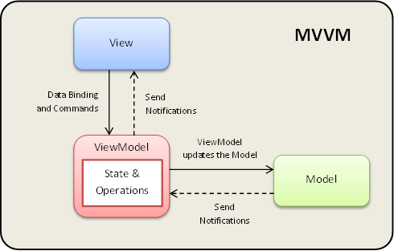

# 3.4 Architettura
## 3.4.1 Framework

È stato scelto Angular 2+ come framework per lo sviluppo della web-app. Angular implementa il pattern architetturale *Model View View Model*, che favorisce la separazione tra *business logic* (Model) e *presentation logic* (View), attraverso l'utilizzo dell'application logic (View model). Ne deriva la possibilità di aggiornare la vista appena cambia lo stato interno del modello. Allo stesso modo, interagendo con la vista e sfruttando il Data Binding e i comandi offerti dal framework, sarà semplice e immediato apportare le modifiche desiderate al modello. Ne deriva quindi l'applicazione del paradigma *separation of concerns*, che garantisce responsabilità differenti alle tre parti del pattern e ne agevola l'estendibilità e la manutenzione.

<figcaption align="center"> <em> Schema del pattern architetturale MVVM </em> </figcaption>

### 3.4.1.1 Model

Nel nostro caso, il *Model* del pattern è composto dagli oggetti che rappresentano le nostre entità (e.g. Organization, Administrator, ecc.) e dai **servizi** (*service* di Angular), che offrono dei metodi per richiedere informazioni al backend e per notificare il View Model in caso di modifiche ai dati.

Le entità sono state progettate attraverso le **interfacce** offerte dal linguaggio TypeScript.

I servizi progettati si dividono in 2 categorie:

-   Servizi per mandare richieste al backend (Rest API)
-   Servizi per la manipolazione dei dati

I primi si occupano di reperire dati dal backend. I secondi hanno l'obiettivo di modificare le istanze di dati reperite per poi aggiornare quelle nel backend, sempre tramite delle chiamate API esposte dai servizi della prima categoria.

### 3.4.1.2 View

La *View* nel nostro caso è composta da dei **template in HTML** "potenziati" con le **direttive** di Angular. Per lo stile la web-app fa affidamento al framework [Bootstrap](https://getbootstrap.com/) e le classi che definisce, alleggerendo il carico di lavoro nel design della vista.

### 3.4.1.3 View Model

Sono stati ampiamente utilizzati i **component** offerti da Angular, che ricoprono il ruolo di *View Model* all'interno dell'MVVM pattern. Sono comparabili all'*application logic* poiché i loro metodi vengono invocati attraverso le direttive definite nella vista e riflettono le azioni desiderate sul modello invocando i metodi esposti dai servizi.

### 3.4.1.4 Comunicazione tra Model e View Model

I dati definiti nei servizi sono spesso istanze di `EventEmitter` o `ReplySubject`, parametrizzati con il tipo desiderato. Il vantaggio di queste classi è che implementano delle varianti del pattern Publisher-Subscriber. Di conseguenza, al variare dei valori dell'`EventEmitter`/`ReplySubject` tutti i subscriber, i component nel nostro caso, ricevono un *notify* per permetterne l'aggiornamento.

### 3.4.1.5 Comunicazione tra View Model e View

Per l'aggiornamento automatico tra View e ViewModel, Angular implementa un *Observable pattern*. Infatti, appena cambia lo stato interno del component viene immediatamente aggiornata anche la vista. Analogamente, tramite il DataBinding e le direttive sarà immediato l'aggiornamento dello stato interno del component una volta che é stata effettuata un'azione dall'utente sulla vista.

## 3.4.2 Dependency Injection
Angular offre un'implementazione del pattern della *Dependency Injection* per risolvere le dipendenze tramite constructor injection. È sufficiente annotare una classe con `@Injectable` per permettere al risolutore delle dipendenze (l'Injector) di iniettarne l'istanza nei costruttori delle classi che la richiedono. Di conseguenza si ha l'*Inversion of Control* che sposta la complessità di creazione delle istanze di oggetti da cui siamo dipendenti nell'Injector di Angular.