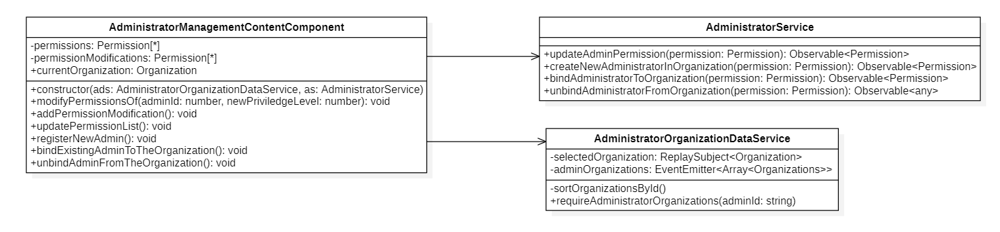
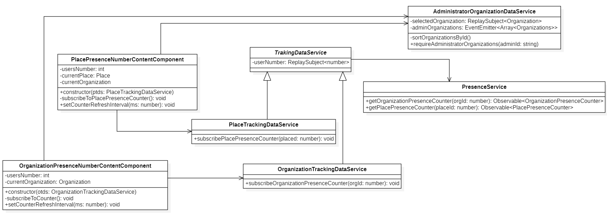
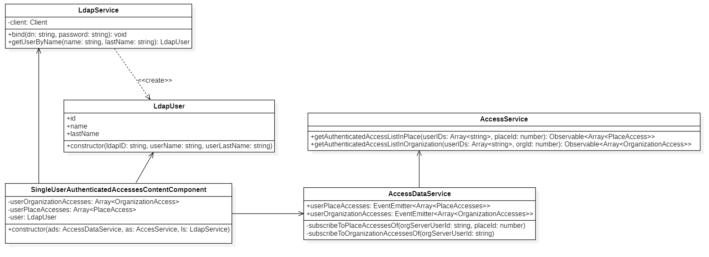
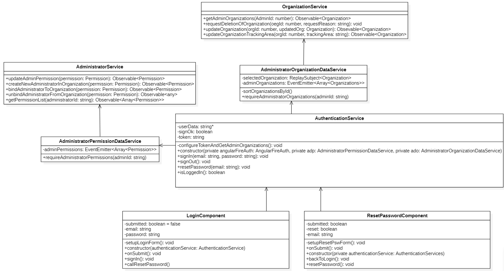

# 3.6 Diagrammi delle classi
Vengono presentati qui di seguito i diagrammi UML delle classi relativi alla applicazione web:

-   Administrator management;

-   Anonymous tracking;

-   Recognized tracking;

-   Authentication;

-   Menubar;

-   Organization management.

!!! info
    Per rendere ogni componente riutilizzabile, mantenibile e facile da testare, si è cercato di progettare componenti che abbiano al loro interno poche responsabilità e che siano il più coese possibili, tenendo però sotto controllo il numero di dipendenze.

## 3.6.1 Administrator management

<figcaption align=center> <em> Diagramma delle classi - Administrator </em> </figcaption>

Nel precedente diagramma viene illustrato come sono state progettate le funzionalità per la gestione degli amministratori.
Il component `AdministratorManagementContentComponent`  contiene come attributi:

-   `permissionModifications`: contiene le modifiche da applicare ai permessi;
-   `permissions`: contiene gli attuali permessi degli amministratori dell'organizzazione contenuta nel attributo `currentOrganization`. I permessi si ottengono con il metodo `getAdministratorListOfOrganization` di `AdministratorService`.

La classe offre i seguenti metodi:

-   `modifyPermissionsOf(adminId: number, newPriviledgeLevel: number)`: Modifica dei permessi di uno specifico amministratore inserendo come parametri l'id e la modifica del privilegio;

-   `addPermissionModification()`: Aggiunge a `permissionModifications` i permessi da modificare. Questo metodo viene richiamato dal metodo precedentemente descritto nel caso in cui si voglia modificare contemporaneamente i permessi di più amministratori;

-   `updatePermissionList()`: Permette l'applicazione delle modifiche nel vettore locale `permissions`;

-   `registerNewAdmin()`: Registra un nuovo amministratore nell'organizzazione nel caso in cui non sia presente nel sistema Stalker;

-   `bindExistingAdminToTheOrganization()`: Registra un nuovo amministratore nell'organizzazione nel caso in cui sia presente nel sistema Stalker;

-   `unbindAdminFromTheOrganization()`: Eliminazione di un amministratore dall'organizzazione. Viene letto dalla *view* l'amministratore selezionato e successivamente eliminato.

Viene inoltre offerta anche la funzionalità di annullamento delle modifiche, infatti le modifiche fatte vengo salvate temporaneamente e solo dopo l'avvenuta conferma da parte dell'amministratore, si procede all'applicazione delle modifiche.

`AdministratorManagementContentComponent` ha due dipendenze di tipo `associazione` verso `AdministratorService` e `AdministratorOrganizationDataService`.

`AdministratorOrganizationDataService` fornisce l'elenco delle organizzazioni in cui l'amministratore è registrato attraverso l'attributo `adminOrganizations` e l'organizzazione su cui si sta lavorando attraverso `selectedOrganization`.

`AdministratorService` fornisce metodi per la comunicazione con il backend:

-   `updateAdminPermission(permission: Permission)`: Permette la modifica dei permessi a un amministratore;

-   `createNewAdministratorInOrganization(permission: Permission)`: Registra un nuovo amministratore nell'organizzazione nel caso in cui non sia attualmente registrato nel sistema Stalker;

-   `bindAdministratorToOrganization(permission: Permission)`: Registra un nuovo amministratore nell'organizzazione nel caso in cui sia presente nel sistema Stalker;

-   `unbindAdministratorFromOrganization(permission: Permission)`: Eliminazione di un amministratore dall'organizzazione.

Si ricorda inoltre che per usufruire di questa funzionalità occorre essere un amministratore di tipo **owner**.

## 3.6.2 Anonymous tracking

<figcaption align=center> <em> Diagramma delle classi - Anonymous tracking </em> </figcaption>

Nel precedente diagramma viene illustrato come sono state progettate le funzionalità per il monitoraggio dei utenti anonimi sia nelle organizzazioni sia nei luoghi dell'organizzazione.
Il component `OrganizationPresenceNumberContentComponent` permette di mostrare il numero di utenti anonimi presenti nell'organizzazione attraverso l'attributo `usersNumber`.
Esistono i seguenti metodi:

 -  `setCounterRefreshInterval(ms: number)`: Imposta l'intervallo di tempo per aggiornare automaticamente il contatore a seconda del parametro in input;

 -  `subscribeToCounter()`: Permette di mantenere aggiornato il contatore delle presenze.

Analogamente `PlacePresenceNumberContentComponent` offre le stesse funzionalità ma per i luoghi dell'organizzazione.

Essi hanno una dipendenza di tipo `associazione` verso `AdministratorOrganizationDataService` che fornisce l'organizzazione su cui si vuole fare monitoraggio.

`OrganizationPresenceNumberContentComponent` ha un'associazione con `OrganizationTrackingDataService` la quale permette di ottenere il numero degli utenti anonimi presenti nell'organizzazione attraverso il metodo `subscribeOrganizationPresenceCounter( orgId:number)`. Per far ciò ha bisogno di utilizzare i metodi offerti da `PresenceService`, i quali permettono di comunicare con il backend.

`PresenceService` offre i seguenti metodi:

-   `getOrganizationPresenceCounter(orgId: number)`: Ritorna il numero di utenti anonimi presenti all'interno dell'organizzazione;

-   `getPlacePresenceCounter(placeId: number)`: Ritorna il numero di utenti anonimi presenti all'interno di un luogo dell'organizzazione.

Analogamente `PlacePresenceNumberContentComponent` ha un'associazione con `PlaceTrackingDataService` il quale offre il numero di utenti anonimi presenti all'interno di un luogo di un'organizzazione.

`OrganizationTrackingDataService` e `PlaceTrackingDataService` sono delle specializzazioni della  classe astratta `TrakingDataService`.

## 3.6.3 Recognized tracking

<figcaption align=center> <em> Diagramma delle classi - Recognized tracking </em> </figcaption>

Il diagramma mostra le classi progettate per permettere di ricercare gli accessi di uno specifico utente autenticato all'interno dell'organizzazione o di un posto.

`SingleUserAuthenticatedAccessesContentComponent` ha l'obiettivo di far comunicare la vista con `LdapService` e `AccessDataService`.

Il component ha i seguenti campi dati:

-   `userOrganizationAccesses`: Memorizza una collezione degli accessi dell'utente autenticato presso l'organizzazione;
-   `userPlaceAccesses`: Memorizza una collezione degli accessi dell'utente nei vari luoghi dell'organizzazione;
-   `user`: Istanza di tipo `LdapUser` che nome e cognome al rispettivo uID dell'utente;

`SingleUserAuthenticatedAccessesContentComponent` ha un'associazione verso `LdapService`, poiché chiamerà il metodo `getUserByName(name: string, lastName: string)` per reperire l'uID dell'utente autenticato identificato da nome e cognome passati come parametri al metodo. `LdapUser` ha una relazione di dipendenza verso `LdapUser` poiché lo creerà dopo aver interrogato il server LDAP dell'organizzazione.

Infine `SingleUserAuthenticatedAccessesContentComponent` ha una relazione di associazione verso `AccessDataService`. Infatti, una volta che si ha ottenuto l'uID aziendale dell'utente ricercato per nome e cognome, sarà possibile inoltrare una richiesta HTTP GET al backend attraverso `AccessDataService`. Quest'ultimo, usufruendo delle REST API esposte da `AccessService`, inoltrerà la richiesta al server.

`AccessDataService` espone due metodi. Il primo permette di ottenere gli accessi effettuati da un utente autenticato presso un dato luogo dell'organizzazione.  Il secondo invece richiede gli accessi di uno specifico utente autenticato presso l'organizzazione desiderata.

## 3.6.4 Authentication

<figcaption align=center> <em> Diagramma delle classi - Authentication </em> </figcaption>

Nel precedente diagramma viene illustrato come è stata progettata la funzionalità di autenticazione nella applicazione web.

`LoginComponent` contiene gli attributi, `submitted` per indicare se è stato cliccato il pulsante *Invio*, `email` che contiene l'email inserita e `password` che contiene la password inserita. La classe espone i seguenti metodi:

-   `setupLoginForm()`: Offre la possibilità di inserire email e password per l'autenticazione e di controllare se sono in una forma valida.

-   `onSubmit()`: Modificare submitted col valore *true*;

-   `sign()`: Richiamare i metodi per il login;

-   `callResetPassword()`: Metodo che viene chiamato quando l'utente clicca sul pulsante *Password dimenticata* per chiamare il controller `ResetPasswordComponent`.

`ResetPasswordComponent` ha gli stessi attributi del controller precedentemente descritto. Si segnala il metodo `resetPassword()` per richiamare i metodi per il reset della password.

`LoginComponent` e `ResetPasswordComponent` hanno un'associazione con `AuthenticationService`, nel quale si segnalano gli attributi `userData`, che rappresenta l'entità dell'utente autenticato. Il component espone i seguenti metodi:

-   `signIn(email: string, password: string)`: Permette l'autenticazione attraverso i servizi di Firebase;

-   `signOut()`: Permette il logout;

-   `resetPassword(email: string)`: Permette il reset della password;

-   `configureTokenAndGetAdminOrganizations()`: Permette di ottenere e inizializzare i permessi e le organizzazioni posseduti da un amministratore.

La classe ha due associazioni:

- con `AdministratorPermissionDataService` che permette di ottenere i permessi di un amministratore attraverso il metodo `requireAdministratorPermissions(adminId: string)`, che verranno successivamente memorizzati nell'attributo `adminPermissions`, offrendoli a chi ne fa richiesta.

    - `AdministratorPermissionDataService` ha a sua volta un'associazione con `AdministratorService`, il quale comunicando con il backend, permette di ottenere i permessi di un amministratore attraverso il metodo `getPermissionList(administratorId: string)`, passando l'id dell'amministratore come parametro.

- L' altra associazione che ha `AuthenticationService` è `AdministratorOrganizationDataService`, che permette di ottenere la lista delle organizzazioni a cui l'amministratore è registrato attraverso il metodo `requireAdministratorOrganizations(adminId: string)`. Successivamente memorizza le organizzazioni ottenute nell'attributo `adminOrganization`, offrendole a chi ne fa richiesta. Inoltre esiste il metodo `sortOrganizationsById()` che ordina la lista delle organizzazioni per id crescente.

    - `AdministratorOrganizationDataService` ha a sua volta ha un'associazione con `OrganizationService`, il quale permette la comunicazione con il backend, permettendo di ottenere la lista delle organizzazioni di un amministratore attraverso il metodo `getAdminOrganizations(AdminId: number)` inserendo l'id dell'amministratore.

## 3.6.5 Menubar

<figcaption align=center> <em> Diagramma delle classi - Menubar </em> </figcaption>

Nel precedente diagramma viene mostrato come è stato progettato il component `MenubarComponent`. Menubar è un component che permette di gestire gli eventi generati della componente grafica omonima *menubar*.
Contiene i seguenti attributi:

- `organization`: Contiene l'organizzazione selezionata dall'utente;
- `orgArr`: Contiene la lista delle organizzazioni da mostrare all'utente;
- `hasLDAP`: Stabilisce se l'organizzazione selezionata richiede autenticazione LDAP;
- `isSubmitted`: Indica se è stato cliccato il pulsante *Invio*;
- `email`: Contiene l'email inserita;
- `password`: Contiene la password inserita.

La classe espone inoltre i seguenti metodi:

-   `setupLdapForm()`: Offre la possibilità di inserire email e password per l'autenticazione LDAP e di controllare se sono in una forma valida;

-   `navigateToHomePage()`: Per gestire l'evento di navigazione verso la *homepage*;

-   `navigateToLogin()`: Per gestire l'evento di navigazione verso la pagina di *Login* dopo il logout;

-   `loadOrganizationList()`: Carica la lista delle organizzazione da mostrare all'utente;

-   `closeLdapForm()`: Gestisce la chiusura del *pop-up* per l'autenticazione LDAP;

-   `signOut()`: Richiama il metodo per il logout();

-   `setOrganization(click: any)`: Sostituisce `organization` con l'organizzazione selezionata dall'utente.

Esiste quindi un'associazione con `AuthenticationService` per gestire il logout.

Vi è inoltre un'associazione con `AdministratorOrganizationDataService`, che offre la lista delle organizzazioni da cui selezionare quella che verrà memorizzata in `AdministratorOrganizationDataService` per ritornarla a chi la richiedesse.

Esiste infine esiste un'associazione con `LDAPService` per permettere l'autenticazione LDAP attraverso il metodo `bind`, il quale comunicherà direttamente col server LDAP aziendale.

## 3.6.6 Organization management

<figcaption align=center> <em> Diagramma delle classi - Organization management </em> </figcaption>

Nel precedente diagramma viene illustrato come è stata progettata la funzionalità di gestione delle organizzazioni.
`OSMMapContentComponent` permette di gestire una mappa geografica attraverso gli attributi, `map` indica l'oggetto mappa, `zoom` indica l'evento di zoom in o zoom out fatto dall'utente e infine `intialOptions` per indicare le impostazioni iniziali della mappa. Offre inoltre `createMap()` per creare la mappa. Questa mappa viene riutilizzata per la visualizzazione delle coordinate sia dei luoghi e sia delle organizzazioni.

`ViewOrganizationTrackingAreaContentComponent` permette la visualizzazione delle coordinate dell'organizzazione attraverso la mappa costruita da `OSMMapContentComponent`.

Ha i seguenti attributi:

-    `currentOrganization`: Indica l'organizzazione su cui si sta lavorando;

-    `perimeterCoordinates`: Contiene le coordinate dell'organizzazione.

Offre il metodo `subscribeToOrganization()` per ottenere le coordinate dell'organizzazione.

Analogo funzionamento per `ViewPlaceTrackingAreaContentComponent` che è dedicato per la visualizzazione delle coordinate dei luoghi di un'organizzazione. Ha in più l'attributo `actualPlace` che indica il luogo su cui si sta lavorando. Ha una associazione con `PlaceService` utilizzata di comunicare con il backend per ottenere le coordinate del luogo attuale.

`PlaceService` ha i seguenti metodi:

-   `createNewPlace(place: Place)`: Permette di creare un nuovo luogo;

-   `deletePlace(placeId: number)`: Permette di cancellare un luogo, indicando il suo id;

-   `getPlaceListOfOrganization(orgId: number)`: Permette di ottenere la lista di luoghi di una specifica organizzazione;

-   `updatePlace(placeId: number, place: Place)`: Permette di modificare uno specifico luogo inserendo il suo id e un nuovo oggetto place con le modifiche.

`ModifyPlaceTrackingAreaContentComponent` Permette di modificare i parametri di un luogo specifico. Ha gli stessi attributi di `ViewPlaceTrackingAreaContentComponent`.

Offre i seguenti metodi:

-   `checkForm()`: Controlla se le coordinate inserite per la modifica siano corrette;

-   `subscribeToOrganization()`: Permette di ottenere l'organizzazione attuale;

-   `createPlace(name: string, nameOrg: string, area: string)`: Permette di creare un nuovo luogo dell'organizzazione inserendo come parametri il nome del luogo, il nome dell'organizzazione di cui fa parte e infine le coordinate;

-   `modifyPlace(name: string, coord: string)`: Permette di modificare le coordinate di un luogo inserendo il suo nome e le modifiche alle coordinate;

-   `deletePlace(name: string)`: Permette di eliminare un luogo da un'organizzazione inserendo come parametro il nome del luogo.

`ModifyPlaceTrackingAreaContentComponent` ha una associazione con `PlaceService`.

`ModifyOrganizationTrackingAreaContentComponent` permette di modificare le coordinate di una organizzazione, ha gli stessi attributi di `ViewOrganizationTrackingAreaContentComponent`.

Ha i seguenti metodi:

-   `checkForm()`: Controlla se le coordinate inserite per la modifica siano corrette;

-   `subscribeToOrganization()`: Permette di ottenere l'organizzazione attuale;

-   `modifyTAOrg(coord: string)`: Permette di modificare le coordinate di una organizzazione inserendo come parametro le nuove coordinate.

Ha una associazione con `OrganizationService`.

`OrganizationService` permette di comunicare con il backend per gestire le organizzazioni.
Ha i seguenti metodi:

-   `requestDeletionOfOrganization(orgId: number, requestReason: string)`: Permette di mandare la richiesta di eliminazione di una organizzazione inserendo il suo id e la motivazione per cui si è richiesto l'eliminazione;

-   `updateOrganization(orgId: number, updatedOrg: Organization)`: Permette di inviare le modifiche fatte a una organizzazione inserendo come parametri il suo id e un nuovo oggetto organization con le modifiche;

-   `updateOrganizationTrackingArea(orgId: number, trackingArea: string)`: Permette di modificare le coordinate di una organizzazione inserendo come parametri l'id dell'organizzazione e le nuove coordinate.

`OrganizationManagementContentComponent` permette di gestire le modifiche a una organizzazione.
Ha i seguenti attributi:

-   `currentOrganization`: Contiene l'organizzazione su cui si sta lavorando;

-   `modifiedIPAddress`: Contiene il nuovo indirizzo IP dell'organizzazione modificato dall'utente;

-   `modifiedAddress`: Contiene il nuovo indirizzo dell'organizzazione modificato dall'utente;

-   `modifiedName`: Contiene il nuovo nome dell'organizzazione modificato dall'utente.

Ha i seguenti metodi:

-   `checkForm()`: Controlla se i dati inserite per la modifica siano nella forma corretta;

-   `subscribeToOrganization()`: Permette di ottenere l'organizzazione attuale;

-   `modifyOrg(nome: string, ind: string, indIP: string)`: Permette di modificare il nome, la via e l'indirizzo IP dell'organizzazione;

-   `deleteOrg(nome: string, reason: string)`: Permette di inviare la richiesta di eliminazione dell'organizzazione inserendo il nome dell'organizzazione e la motivazione per cui si è richiesto l'eliminazione.
