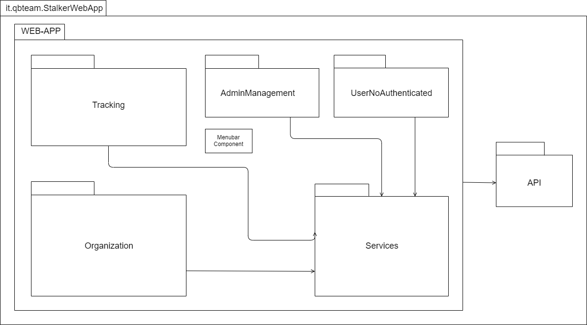
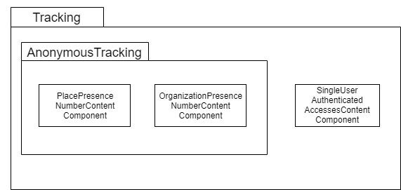
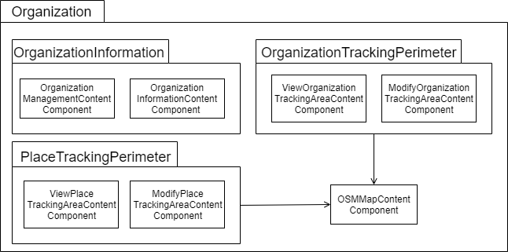
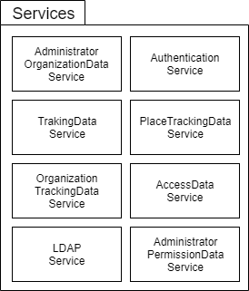
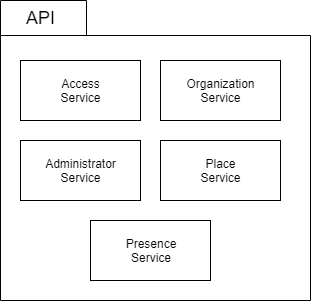
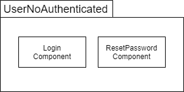
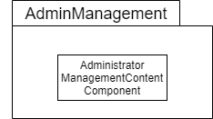

# 3.5 Diagrammi dei package
Vengono presentati qui di seguito i diagrammi UML dei package relativi alla applicazione web.
## 3.5.1 Visione generale delle dipendenze tra package
Nel seguente diagramma UML dei package vengono mostrate tutte le dipendenze che esistono tra i vari package.

  
  <figcaption align="center"> <em> Diagramma dei package - Visione delle dipendenze </em> </figcaption>

## 3.5.2 Tracking
Nel seguente package vengono raggruppate tutte le classi dedicate alle attività di monitoraggio, le quali condividono le stesse dipendenze. Si è scelto di fare un ulteriore sotto raggruppamento tra classi dedicate al monitoraggio di utenti anonimi separando la classe dedicata al monitoraggio di utenti riconosciuti.

<figcaption align="center"> <em> Diagramma dei package - Package del Tracking </em> </figcaption>

## 3.5.3 Organization
Nel seguente package vengono raggruppate tutte le classi dedicate alle funzionalità eseguite sulle organizzazioni e loro relativi luoghi, le quali condividono le stesse dipendenze. Si è scelto di creare 3 sotto package, uno per la gestione delle informazioni di una organizzazione, uno per la gestione dell'area di tracciamento dell'organizzazione e un altro analogo per i luoghi.

<figcaption align="center"> <em> Diagramma dei package - Package del Organization </em> </figcaption>

## 3.5.4 Services
Nel seguente package vengono raggruppate tutti i services che contengono informazioni e metodi molto riutilizzati all'interno della applicazione web.

<figcaption align="center"> <em> Diagramma dei package - Package dei Services </em> </figcaption>

## 3.5.5 API
Nel seguente package vengono raggruppate tutti le API utilizzate per comunicare con il backend.

<figcaption align="center"> <em> Diagramma dei package - Package delle API </em> </figcaption>

## 3.5.6 UserNoAuthenticated
Nel seguente package vengono raggruppate tutte le component che vengono utilizzate solo quando l'utente non è autenticato.

<figcaption align="center"> <em> Diagramma dei package - Package del UserNoAuthenticated </em> </figcaption>

## 3.5.7 AdminManagement
Nel seguente package vengono raggruppate tutte le component utilizzate per il tracciamento di utenti riconosciuti.

  
  <figcaption align="center"> <em> Diagramma dei package - Package del AdminManagement </em> </figcaption>

 