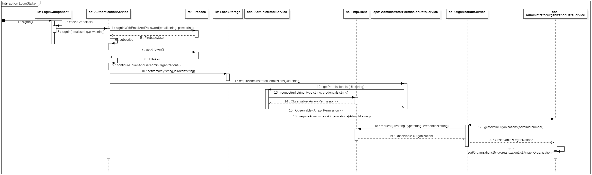
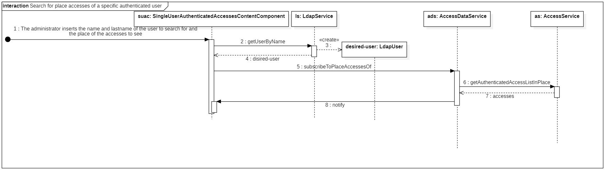
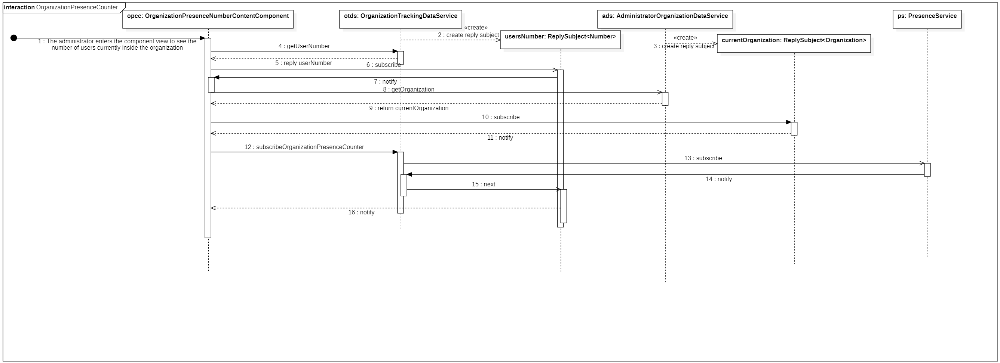
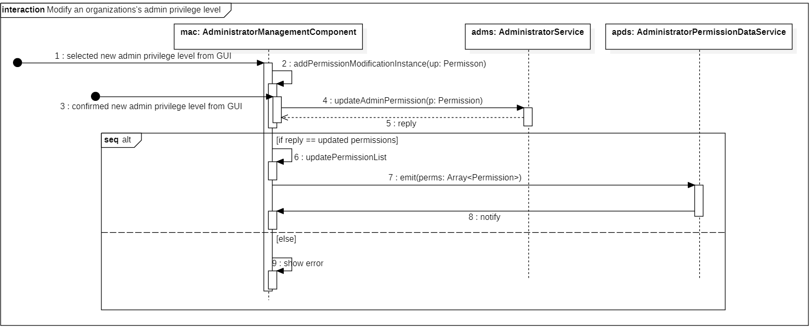

# 3.7 Diagrammi delle sequenze 

Vengono qua presentati alcuni diagrammi di sequenza per fornire chiarezza sull'interazione tra gli oggetti per alcune funzionalità che richiedono l'interazione di più componenti.

Vengono di seguito rappresentati dei diagrammi di sequenza per:

-   Il login dell'amministratore nella web-app;
-   Visualizzazione degli accessi in un luogo di un utente autenticato;
-   La visualizzazione del contatore di presenze, in tempo reale, presso l'attuale organizzazione;
-   Modifica dei privilegi di un admin.

## 3.7.1 Diagramma del login dell'amministratore

<figcaption> <em> Diagramma di sequenza del login e del caricamento dei suoi permessi e delle organizzazioni </em> </figcaption>

Nel diagramma soprastante viene rappresentata la sequenza di interazione tra istanze di servizi e il `LoginComponent` per verificare il login dell'amministratore. Viene anche rappresentato come vengano caricate le organizzazioni e i relativi permessi a cui l'amministratore ha accesso.

Inizialmente abbiamo un segnale esterno per l'amministratore che inserisce e-mail e password e clicca sul pulsante di login. Il `LoginComponent` (`lc`) validerà dapprima che le informazioni inserite nel form grafico rispettino i requisiti minimi (p.e. che i campi mail e password non siano vuoti). Se le credenziali dovessero risultare valide, `lc` invoca il metodo `signIn` del servizio `AuthenticationService` (`as`), il quale si occupa di invocare metodi dalla libreria FireBase, che comunicheranno con il database di Firebase per verificare la correttezza delle credenziali. Qualora le credenziali inserite fossero corrette verrebbe ritornato un Observable di un oggetto utente di Firebase, al quale ci sottoscriviamo. Si riceverà dunque il valore dell'oggetto utente, che useremo per recuperare il token d'accesso dell'amministratore, necessario per comunicare con il backend attraverso le REST API.

Ora che l'autenticazione è stata completata, si ha la necessità di caricare i permessi dell'amministratore autenticato, che descrivono l'ID delle organizzazioni a cui ha accesso e i rispettivi privilegi. Viene quindi invocato, sempre in `as`, il metodo `configureTokenAndGetAdminOrganizations()`, che provvederà prima a salvare il token dell'utente nello local storage di Angular e poi a fare una richiesta ad `AdministratorPermissionDataService` (`aps`) per reperire i permessi dell'amministratore. Il token ha la necessità di essere salvato nello local storage cosicché, successivamente, i servizi delle REST API possano ricavarlo per integrarlo nelle richieste che manderanno al backend. Per salvare il token nello local storage verrà dunque invocato il metodo setItem di `LocalStorage` (`ls`) fornendo una key e il token (value).

È giunto il momento di caricare i permessi dell'amministratore. Verrà pertanto invocato il metodo `requireAdministratorPermissions`, di `aps`, che attraverso l'`AdministratorService` (`as`) invierà una richiesta HTTP al backend per ottenere la lista di permessi dell'amministratore identificato dall'uID passato come parametro. Il valore ritornato all'`aps` sarà un `Observable` di un array di permessi, al quale i component e gli altri servizi si sottoscriveranno in caso di necessità.

Infine `as` invocherà `requireAdministratorOrganizations` di `AdministratorOrganizationService` (`aos`) per caricare le organizzazioni a cui l'amministratore ha accesso, cosicché i component e gli altri servizi possano sottoscriversi all'Observable ritornato per ottenere i valori di cui necessitano.

## 3.7.2 Diagramma degli accessi di un utente presso un luogo

<figcaption> <em> Diagramma di sequenza degli accessi di un utente autenticato presso uno specifico luogo </em> </figcaption>

Nel diagramma viene rappresentato come reperire gli accessi effettuati da un utente autenticato presso un luogo specifico dell'organizzazione.

Come messaggio iniziale abbiamo la ricezione del nome e cognome dell'utente e il luogo d'interesse. Viene quindi invocato `getUserByName` dell'`LdapService` che esegue un'operazione di tipo search al server LDAP aziendale, con i parametri ottenuti creerà un istanza di `LdapUser` che servirà ad associare gli accessi al nome. Infatti, nell'istanza `desiredUser`vi è l'uID dell'utente che possiamo usare per ottenere gli accessi da esso effettuati presso il luogo desiderato. Procediamo dunque invocando `subscribeToPlaceAccessesOf(uId)` di `AccessDataService` (`as`), il quale invocherà la chiamata API per il backend attraverso il metodo `getAuthenticatedAccessListInPlace(uID, place)`. Verranno ritornati gli accessi effettuati dall'utente desiderato presso il luogo preselezionato, cosicché una volta che `ac` ci avrà notificato della disponibilità dei dati a cui ci siamo sottoscritti, li otterremo e li mostreremo tramite la vista all'amministratore, associando nome e cognome agli accessi ricevuti.

## 3.7.3 Diagramma del contatore presenze di un'organizzazione

<figcaption> <em> Diagramma di sequenza per la visualizzazione del contatore presenze in una data organizzazione </em> </figcaption>

Il diagramma ha come segnale iniziale l'accesso, da parte dell'amministratore, nella sezione di monitoraggio del numero presenze dell'organizzazione. I principali oggetti di questo diagramma sono l'`OrganizationPresenceNumberContentComponent` (`opcc`) che conterrà il valore del contatore da mostrare poi nella vista, l'`OrganizationTrackingDataService` (`otds`) che, tramite il `PresenceService` (`ps`), inoltrerà una richiesta HTTP al backend per ottenere il numero di utenti attualmente presenti nell'organizzazione e infine l'`AdministratorOrganizationService` (`ads`) che si occuperà semplicemente di tenere traccia dell'organizzazione attuale.

Subito dopo il messaggio iniziale e la creazione dei `ReplySubject` in `odts` e `ads` l'`opcc` invoca `getUserNumber` su `odts`. In risposta si avrà un riferimento a `userNumber` (il contatore di interesse) che attualmente è nullo a cui però ci sottoscriviamo in previsione degli "step" successivi dove verrà aggiornato, in modo da ottenere subito il `notify`. Analogamente ci sottoscriviamo all'organizzazione attuale (`currentOrganization`) e otterremo subito in risposta l'organizzazione attuale. Ora che possediamo l'ID dell'organizzazione di interesse possiamo fare una chiamata al `PresenceService` (`ps`) tramite l'`odts`. Il `notify` di `ps` aggiornerà il contatore `usersNumber`, a cui ci eravamo precedentemente sottoscritti, cosicché riceveremo il `notify` con il valore aggiornato da mostrare nella vista.

## 3.7.4 Diagramma della modifica dei privilegi di un amministratore

<figcaption> <em> Diagramma di sequenza per la modifica dei privilegi di un amministratore </em> </figcaption>

Come messaggio iniziale abbiamo la selezione di un nuovo livello di permessi, di uno specifico amministratore, tramite la vista. L'`AdministratorManagementComponent` (`amc`) si salva l'istanza di modifica in una collezione. Appena l'amministratore conferma la sua intenzione di cambiare il livello di privilegi dell'amministratore desiderato, viene invocato `updateAdminPermission(p: Permission)` di AdministratorService che invierà una richiesta HTTP al backend per apportare le modifiche desiderate in maniera definitiva. Se la richiesta è andata a buon fine allora si rifletterà la modifica anche localmente, prima modificando la lista di permessi dei vari amministratori di `amc` e poi emettendo, con tale lista, un segnale (servendosi di `AdministratorPermissionDataService`) per notificare tutti i component dipendenti dei nuovi privilegi. Se il backend avesse risposto con un errore alla richiesta HTTP allora verrebbe solamente mostrato il messaggio d'errore, senza modificare le informazioni locali relative ai permessi.